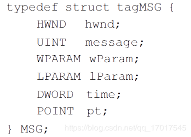
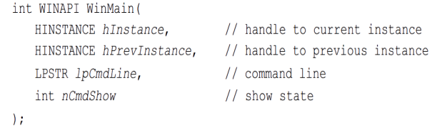
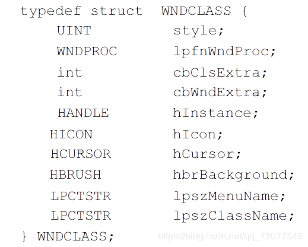
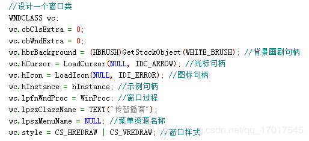
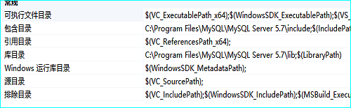

# 概念
## 调用机制

```c
#define CALLBACK __stdcall
#define WINAPI __stdcall
#define WINAPIV __cdecl
#define APIENTRY WINAPI
#define APIPRIVATE __stdcall
#define PASCAL __stdcall
```

__stdcall和__cdecl是两种函数名字修饰（注意是两个下划线），规定了函数参数的入栈方式。
相同点：

__stdcall还是__cdecl函数参数都是从右向左入栈的
并且由调用者完成入栈操作
不同点:
__stdcall方式在函数返回前自动清空堆栈
__cdecl则由调用者维护内存堆栈
由__cdecl约定的函数只能被C/C++调用。
Windows上不管是C还是C++，默认使用的都是__stdcall方式。

## 窗口句柄（ HWND）
在 Windows 应用程序中， 窗口是通过窗口句柄（ HWND） 来标识的。 我们要对某个窗口进行操作， 首先就要得到这个窗口的句柄。 句柄（ HANDLE） 是 Windows 程序中一个重要的概念， 使用也非常频繁。 在 Windows 程序中， 有各种各样的资源（ 窗口、 图标、光标,画刷等）， 系统在创建这些资源时会为它们分配内存， 并返回标识这些资源的标识号， 即句柄。 在后面的内容中我们还会看到图标句柄（ HICON）、 光标句柄（ HCURSOR） 和画刷句柄（ HBRUSH）。

## 消息与消息队列

第一个成员变量 hwnd 表示消息所属的窗口。我们通常开发的程序都是窗口应用程序，一个消息一般都是与某个窗口相关联的。例如，在某个活动窗口中按下鼠标左键，产生的按键消息就是发给该窗口的。在 Windows 程序中，用 HWND类型的变量来标识窗口。
第二个成员变量 message 指定了消息的标识符。 在 Windows 中， 消息是由一个数值来表示的， 不同的消息对应不同的数值。 但是由于数值不便于记忆， 所以 Windows 将消息对应的数值定义为 WM_XXX 宏（ WM 是 Window Message 的缩写） 的形式， XXX 对应某种消息的英文拼写的大写形式。 例如， 鼠标左键按下消息是 WM_LBUTTONDOWN， 键盘按下消息是 WM_KEYDOWN， 字符消息是 WM_CHAR ， 等等。 在程序中我们通常都是以WM_XXX 宏的形式来使用消息的。
第三、 第四个成员变量 wParam 和 lParam，用于指定消息的附加信息。 例如， 当我们收到一个字符消息的时候，message 成员变量的值就是 WM_CHAR， 但用户到底输入的是什么字符，那么就由 wParam 和 lParam 来说明。wParam、lParam 表示的信息随消息的不同而不同。如果想知道这两个成员变量具体表示的信息，可以在 MSDN 中关于某个具体消息的说明文档查看到。WPARAM 和 LPARAM 这两种类型的定义，实际上就是 unsigned int和 long。
第五、第六个变量分别表示消息投递到消息队列中的时间和鼠标的当前位置。


#### 消息队列
每一个 Windows 应用程序开始执行后， 系统都会为该程序创建一个消息队列， 这个消息队列用来存放该程序创建的窗口的消息。 例如， 当我们按下鼠标左键的时候， 将会产生WM_LBUTTONDOWN 消息， 系统会将这个消息放到窗口所属的应用程序的消息队列中，等待应用程序的处理。 Windows 将产生的消息依次放到消息队列中， 而应用程序则通过一个消息循环不断地从消息队列中取出消息， 并进行响应。 这种消息机制， 就是 Windows程序运行的机制

## WinMain
当 Windows 操作系统启动一个程序时，它调用的就是该程序的 WinMain 函数（ 实际是由插入到可执行文件中的启动代码调用的）。 



第一个参数 hInstance 表示该程序当前运行的实例的句柄，这是一个数值。当程序在Windows 下运行时，它唯一标识运行中的实例（ 注意，只有运行中的程序实例， 才有实例句柄）。一个应用程序可以运行多个实例，每运行一个实例，系统都会给该实例分配一个句柄值，并通过 hInstance 参数传递给 WinMain 函数。
第二个参数 hPrevInstance 表示当前实例的前一个实例的句柄。通过查看 MSDN 我们可以知道，在 Win32 环境下，这个参数总是 NULL，即在 Win32 环境下，这个参数不再起作用。
第三个参数 lpCmdLine 是一个以空终止的字符串， 指定传递给应用程序的命令行参数。
第四个参数 nCmdShow 指定程序的窗口应该如何显示，例如最大化、最小化、隐藏等。这个参数的值由该程序的调用者所指定，应用程序通常不需要去理会这个参数的值。

# 窗口开发流程
##  创建窗口 WNDCLASS 
窗口的特征就是由 WNDCLASS 结构体来定义的。

第一个成员变量 `style` 指定这一类型窗口的样式，常用的样式如下：

1. CS_HREDRAW
当窗口水平方向上的宽度发生变化时， 将重新绘制整个窗口。 当窗口发生重绘时， 窗口中的文字和图形将被擦除。如果没有指定这一样式，那么在水平方向上调整窗口宽度时，将不会重绘窗口。
2. CS_VREDRAW
当窗口垂直方向上的高度发生变化时，将重新绘制整个窗口。如果没有指定这一样式，那么在垂直方向上调整窗口高度时，将不会重绘窗口。
3. CS_NOCLOSE
禁用系统菜单的 Close 命令，这将导致窗口没有关闭按钮。
4. CS_DBLCLKS
当用户在窗口中双击鼠标时，向窗口过程发送鼠标双击消息。


第二个成员变量 `lpfnWndProc` 是一个函数指针，指向窗口过程函数，窗口过程函数是一个回调函数。回调函数不是由该函数的实现方直接调用，而是在特定的事件或条件发生时由另外一方调用的，用于对该事件或条件进行响应。
针对 Windows 的消息处理机制， 窗口过程函数被调用的过程如下(了解即可)：

在设计窗口类的时候，将窗口过程函数的地址赋值给 lpfnWndProc 成员变量。
调用 RegsiterClass(&wndclass)注册窗口类，那么系统就有了我们所编写的窗口过程函数的地址。
当应用程序接收到某一窗口的消息时，调用 DispatchMessage(&msg)将消息回传给系统。系统则利用先前注册窗口类时得到的函数指针，调用窗口过程函数对消息进行处理。
一个 Windows 程序可以包含多个窗口过程函数，一个窗口过程总是与某一个特定的窗口类相关联（ 通过 WNDCLASS 结构体中的 lpfnWndProc 成员变量指定）， 基于该窗口类创建的窗口使用同一个窗口过程。

lpfnWndProc 成员变量的类型是 WNDPROC，WNDPROC 的定义如下：
```C
typedef LRESULT (CALLBACK* WNDPROC)(HWND, UINT, WPARAM, LPARAM);
```
在这里又出现了两个新的数据类型 LRESULT 和 CALLBACK，它们实际上是 long 和__stdcall。从 WNDPROC 的定义可以知道， WNDPROC 实际上是函数指针类型。

第三个成员变量 `cbClsExtra`： 用于存储类的附加信息，一般我们将这个参数设置为 0。
第四个成员变量 `cbWndExtra`：窗口附加内存，一般我们将这个参数设置为 0。
第五个成员变量 `hInstance` 指定包含窗口过程的程序的实例句柄。
第六个成员变量 `hIcon` 指定窗口类的图标句柄。这个成员变量必须是一个图标资源的句柄，如果这个成员为 NULL，那么系统将提供一个默认的图标。在为 hIcon 变量赋值时，可以调用 LoadIcon 函数来加载一个图标资源，返回系统分配给该图标的句柄。 该函数的原型声明如下所示：
```C
HICON LoadIcon( HINSTANCE hInstance, LPCTSTR lpIconName)
```
第七个成员变量 `hCursor` 指定窗口类的光标句柄。 这个成员变量必须是一个光标资源的句柄， 如果这个成员为 NULL， 那么无论何时鼠标进入到应用程序窗口中， 应用程序都必须明确地设置光标的形状。在为 hCursor 变量赋值时，可以调用 LoadCursor 函数来加载一个光标资源， 返回系统分配给该光标的句柄。该函数的原型声明如下所示：
```C
HCURSOR LoadCursor(HINSTANCE hInstance, LPCTSTR lpCursorName);
```
第八个成员变量 `hbrBackground` 指定窗口类的背景画刷句柄。当窗口发生重绘时，系统使用这里指定的画刷来擦除窗口的背景。我们可以调用 GetStockObject 函数来得到系统的标准画刷。 GetStockObject 函数的原型声明如下所示：
```C
HGDIOBJ GetStockObject( int fnObject);
```
GetStockObject 函数不仅可以用于获取画刷的句柄， 还可以用于获取画笔、字体和调色板的句柄。由于 GetStockObject 函数可以返回多种资源对象的句柄，在实际调用该函数前无法确定它返回哪一种资源对象的句柄，因此它的返回值的类型定义为 HGDIOBJ， 在实际使用时，需要进行类型转换。
第九个成员变量 `lpszMenuName` 是一个以空终止的字符串， 指定菜单资源的名字。如果将lpszMenuName 成员设置为 NULL，那么基于这个窗口类创建的窗口将没有默认的菜单。要注意，菜单并不是一个窗口，很多初学者都误以为菜单是一个窗口。
第十个成员变量 `lpszClassName`是一个以空终止的字符串，指定窗口类的名字。


## 注册
设计完窗口类（ WNDCLASS） 后， 需要调用 RegisterClass 函数对其进行注册，注册成功后， 才可以创建该类型的窗口。 注册函数的原型声明如下：
ATOM RegisterClass(CONST WNDCLASS *lpWndClass);
该函数只有一个参数， 即上一步骤中所设计的窗口类对象的指针。
核心代码：
```C
RegisterClass（&wc）；
```
# CDialog
## DoDataExchange()
在程序运行界面中，用户往往会改变控件的属性，例如，在编辑框中输入字符串，或者改变组合框的选中项，又或者改变复选框的选中状态等。控件的属性改变后MFC会相应修改控件关联变量的值。这种同步的改变是通过MFC为对话框类自动生成的成员函数DoDataExchange()来实现的，这也叫做对话框的数据交换和检验机制。

但是这种数据交换机制中，DoDataExchange()并不是被自动调用的，而是需要我们在程序中调用CDialogEx::UpdateData()函数，由UpdateData()函数再去自动调用DoDataExchange()的。

       CDialogEx::UpdateData()函数的原型为：

       BOOL UpdateData(BOOL bSaveAndValidate = TRUE);

       参数：bSaveAndValidate用于指示数据传输的方向，TRUE表示从控件传给变量，FALSE表示从变量传给控件。默认值是TRUE，即从控件传给变量。

       返回值：CDialogEx::UpdateData()函数的返回值表示操作是否成功，成功则返回TRUE，否则返回FALSE。


## DoModal()
CDialog::DoModal()的返回值为IDOK，IDCANCEL。表明操作者在对话框上选择“确认”或是“取消”。由于在对话框销毁前DoModal不会返回，所以可以使用局部变量来引用对象。在退出函数体后对象同时也会被销毁。而对于无模式对话框则不能这样使用

同样的在你的对话框类中为了向调用者返回不同的值可以调用CDialog::OnOK()或是CDialog::OnCancel()以返回IDOK或IDCANCEL，如果你希望返回其他的值，你需要调用 
CDialog::EndDialog( int nResult );其中nResult会作为DoModal()调用的返回值。
```C
void CMy52_s1View::OnLButtonDown(UINT nFlags, CPoint point) 
{ //创建对话框并得到返回值
	CView::OnLButtonDown(nFlags, point);
	CTestDlg dlg;
	int iRet=dlg.DoModal();
	CString szOut;
	szOut.Format("return value %d",iRet);
	AfxMessageBox(szOut);
}
//重载OnOK,OnCancel
void CTestDlg::OnOK()
{//什么也不做
}
void CTestDlg::OnCancel()
{//什么也不做
}
//在对话框中对三个按钮消息进行映射
void CTestDlg::OnExit1() 
{
	CDialog::OnOK();
}
void CTestDlg::OnExit2() 
{
	CDialog::OnCancel();
}
void CTestDlg::OnExit3() 
{
	CDialog::EndDialog(0XFF);
}
```
## OnInitDialog()
此外在对话框被生成是会自动调用BOOL CDialog::OnInitDialog()，你如果需要在对话框显示前对其中的控件进行初始化，你需要重载这个函数，并在其中填入相关的初始化代码。

利用ClassWizard可以方便的产生一些默认代码，首先打开ClassWizard，选择相应的对话框类，在右边的消息列表中选择WM_INITDIALOG并双击，如图，ClassWizard会自动产生相关代码，代码如下：

BOOL CTestDlg::OnInitDialog() 
{
	/*先调用父类的同名函数*/
	CDialog::OnInitDialog();
	/*填写你的初始化代码*/	
	return TRUE; 
}

# VC mysql

C:\Program Files\MySQL\MySQL Server 5.6

1. 打开项目 –> 属性 –>VC++目录,把include和lib分别添加到包含目录和库目录即可


2. 打开项目 –> 属性 –> 链接器 –> 输入 –> 附加依赖项 ,把libmysql.lib添加进去，也可以在cpp文件中手动添加.

3. 因为是动态链接库，所以在做完上面的配置后，要将MySQL安装目录下的libmysql.dll文件拷贝到MFC工程目录下，如果以后要发行的话这个也要打包进去。否则运行时会提示缺少此库。

## Q & A

因为我的系统是64位的，当时安装的mysql也是64位的，但是我用visual sutido 2013创建的项目默认是32位的，所以导致该错误出现，解决方法最好就是改用32位的mysql，也可以将项目编译为64位，步骤如下：
1 需要项目属性---->配置属性--->连接器--->高级-->目标计算机,改为64位系统，
2解决方案页 ---> 属性--->配置属性--->平台 ：改为64位系统


