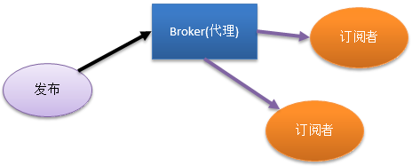
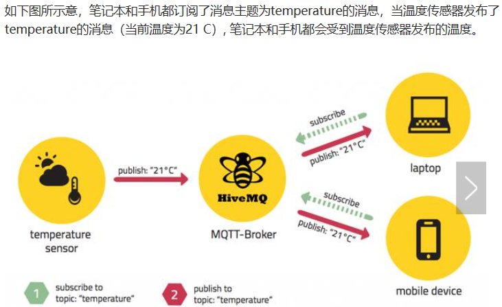

# Message Queue Telemetry Transport(MQTT)
设计思想：开放、简单、轻量、易于实现。适用于受限环境。特别是，网络代价昂贵、带宽低、不可靠的环境。能在处理器和内存资源有限的嵌入式设备运行。

# 简介
MQTT协议用于低端的产品比较适合。所以常常会看到他与物联网一起出现

- Broker代理：很多人理解为中间件，当然可以这样子认为。他就是一个中间件。用于处理信息并发送到相应的订阅者。
- 发布者：用于发布信息到代理上面。注意：发布者也可以是订阅者。
- 订阅者：就是用于接受信息的客户端。
- 在通信之间，还需要用一叫“主题”的概念。主题就是用于订阅者需要什么信息。或是理解为订阅者对哪种信息感兴，然后就订阅对应的主题，这样子订阅者就能够接受到相应的主题信息。

MQTT协议和HTTP协议一样都是基于TCP/IP网络协议上来进行的。同时在消息的传输上又做了三种模式：
- 最多一次（QoS == 0），消息发布完全依赖底层TCP/IP，会发生消息丢失或重复。例如，环境传感器数据，丢一次无所谓，还会有第2次发送。
- 至少一次（QoS == 1），确保消息到达，但可能重复。
- 只有一次（QoS == 2），确保消息到达一次。例如，计费系统，消息重复或者丢失会导致不正确的结果。小型传输，开销很小（固定长度的头部是2字节），协议交换最小化，以降低网络流量。

即然是通信，那么通信包的设计是少不了的。通信包是以二进字流进行的。

HTTP协议里面一个请求就是有一个对应的响应回来。而MQTT也可以这样子讲，只是这里要换另一种说法——一个请求就要一个确定。连接(CONNECT)，有一个连接确定(CONNACK)。发布(PUBLISH)，有一个发布确定(PUBACK).只有最后的关闭(DISCONNECT)没有对应的确定。当客户端发来一个关闭的请求的时候，服务端不必要回应一个确定给客户端

