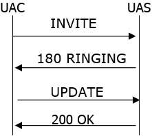

# 协议解析

SIP协议采用Client/Server模型。每一个请求（Request）触发服务器的一个操作；每个操作被称为方法（Method）；每个请求除了指明具体方法外，还携带了一系列的头域（Header field）,这些头域携带了各种业务信息；除了头域外，消息中还可以携带任意类型的消息体（Body），呼叫中最常使用的SDP信息就是通过消息体在Client和Server之间传递的。Server从接收到请求到处理完毕，要回复多个临时响应(Response)，和一个终结响应(Response)，终结响应有且只有一个。
请求和他的所有响应构成一个事务（Transaction），一个完整的呼叫过程包含多个事务，比如呼叫建立和呼叫释放就是
两个相互独立的事务。

用户代理（User Agent）是发起或者接收呼叫的逻辑实体。
- 用户代理客户端-UAC（User Agent Client），用于发起请求；
- 用户代理服务器-UAS（User Agent Server），用于接收请求。
- UAC/UAS的划分是针对一个事务的。在一个呼叫中的多个事务里，UAC和UAS的角色是可以互换的。例如在A和B的呼叫中，A向B发起呼叫，在呼叫建立的事务中，A是UAC，B是UAS；呼叫结束时，B先挂机，在呼叫释放的事务中，B是UAC，A是UAS。换句话说，每个一般的UA都是UAS和UAC的结合体。

Proxy Server作为一个网络逻辑实体代理客户端转发请求或者响应；同Proxy Server类似的还有一种设备是B2BUA，
就是背背的两个UA组成的一个逻辑实体，它作为UAS终结一个事务，同时作为UAC发起另外一个事务。Proxy Server同B2BUA相比，Proxy Server是一个事务传递过程中的中间节点，而B2BUA将一个事务转变成另一个事务。

在SIP组网中还包括Location Server、Registrar、Redirect Server，分别负责维护地址映射表，注册管理，呼叫重定向。他们和Proxy Server 可以在同一台设备上也可以运行于不同的设备上。

SIP Server是Proxy Server、Location Server、Registrar、Redirect Server的总称。
SIP Server采用B2BUA模型。接受请求端为UAS端，代理转发或主动发起请求端为UAC端，整个SIPServr为UAC/UAS的组合体。通过UAC/UAS之间消息交互完成会话的建立、改变、结束的阶段。SIP Server协助网关交换媒体信息，
但不参与会话建立后媒体流传输。 

## 在SIP消息中PRACK的含义和使用
PRACK（the Provisional Response ACKnowledgement） 

SIP中的最终响应是会可靠传输的，例如对应INVITE的200OK响应，UAC会给一个ACK，告诉UAS已经收到了200OK。200与ACK间的可靠性是end-to-end的。PRACK是SIP消息中保证临时消息(101-199)可靠传输的机制。PRACK就是仿照200OK的可靠性响应，对除100以外的1xx临时响应（100是hop-to-hop的），进行可靠性传输。PRACK一般是对收到183 call in progress/180 ringing的确认，

### PRACK的实现
UAC与UAS对是否支持该扩展的协商，就是通过一个option tag -- 100rel。

为达到该目的，UAC有两种选择，在INVITE消息中加入Require:100rel或者Supported:100rel。UAS在接受到上述消息中，也存在选择的问题。
- 当INVITE中含有Supported:100rel，UAS在发送临时消息中，可以根据UAS中是否支持PRACK决定发送临时消息中的参数。如果支持则临时消息中加入Require:100rel和Rseq字段，接到该消息UAC发送PRACK；否则不加上述参数，UAC不发PRACK。
- 当INVITE中含有Require:100rel。UAS如果不支持PRACK需要使用420（不正确的扩展）来拒绝呼叫。否则临时消息中加入Require:100rel和Rseq字段，接到该消息UAC发送PRACK。

- 例如：UAC发起的INVITE中含有Supported:100 rel,而UAS也支持该扩展并且在183响应中有Require:100rel，说明接下来会话中，对所有100以外的1xx响应，均要有PRACK回应。 

- PRACK被定义在RFC3262中

## SIP协议中的请求类型

### 核心方法(Core Methods)

1. 一个INVITE方法用于建立用户代理之间的媒体会话。

2. BYE用于终止已建立的会话的方法。这是可以通过主叫方或被叫方结束会话被发送SIP请求。BYE请求通常路线端到端，绕过代理服务器。

3. REGISTER请求可以被转发或代理，直到它到达指定域的权威注册机构。它所携带的AOR（记录地址）在为正在注册的用户的头。

4. CANCEL用于终止未建立会话。它可以通过一个用户代理或代理服务器来发送。CANCEL是一个逐跳转发请求

5. ACK用于确认最后的响应的INVITE方法.对于2xx应答，ACK是端到端的，但对于所有其他最终响应，它可以逐跳转发

6. OPTIONS方法用于查询的用户代理或围绕其功能的代理服务器，并发现其当前的可用性

### 扩展方法(Extension Methods)
1. Subscribe所使用的用户代理建立了订阅获取通知的有关特定事件的目的。
它有一个时间周期，在Expires头字段，指示存在一个订阅的所需的持续时间。

2. NOTIFY是用来由用户代理传达的特定事件的发生

3. PUBLISH请求类似于一个NOTIFY，不同之处在于它不是在对话发送。一个PUBLISH请求必须包含一个Expires头字段和Min-Expires头字段域。

4. REFER必须包含一个Refer-To头。这是参考一个强制性的头。REFER可以在内部或在对话外发送。202 Accepted 将引发REFER请求这表明其他用户代理已经接受了

5. INFO所使用的用户代理发送呼叫信令信息
6. UPDATE用于修改会话的状态

7. PRACK用于确认收到临时响应（1XX）可靠传输

8. MESSAGE
它是用来发送即时消息或使用SIP IM。消息可以在对话中或在对话外发送。

# 相关概念
## SRTP协议

VoIP网络很不安全，SRTP，即安全实时传输协议(Secure Real-time Transport Protocol)，其是在实时传输协议(Real-time Transport Protocol)基础上所定义的一个协议，旨在为单播和多播应用程序中的实时传输协议的数据提供加密、消息认证、完整性保证和重放保护。它是由David Oran(思科)和Rolf Blom(爱立信)开发的，并最早由IETF于2004年3月作为RFC 3711发布。

由于实时传输协议和可以被用来控制实时传输协议的会话的实时传输控制协议(RTP Control Protocol)有着紧密的联系，安全实时传输协议同样也有一个伴生协议，它被称为安全实时传输控制协议(Secure RTCP或SRTCP)；安全实时传输控制协议为实时传输控制协议提供类似的与安全有关的特性，就像安全实时传输协议为实时传输协议提供的那些一样。

在使用实时传输协议或实时传输控制协议时，使不使用安全实时传输协议或安全实时传输控制协议是可选的；但即使使用了安全实时传输协议或安全实时传输控制协议，所有它们提供的特性（如加密和认证）也都是可选的，这些特性可以被独立地使用或禁用。唯一的例外是在使用安全实时传输控制协议时，必须要用到其消息认证特性。

为了提供对数据流的保密，需要对数据流进行加密和解密。关于这一点，安全实时传输协议(结合安全实时传输控制协议)只为一种加密算法，即AES制定了使用标准。这种加密算法有两种加密模式，它们能将原始的AES块密文转换成流密文：分段整型计数器模式和f8模式。

除了AES加密算法，安全实时传输协议还允许彻底禁用加密，此时使用的是所谓的“零加密算法”。它可以被认为是安全实时传输协议支持的第二种加密算法，或者说是它所支持的第三种加密模式。事实上，零加密算法并不进行任何加密，也就是说，加密算法把密钥流想像成只包含“0”的流，并原封不动地将输入流复制到输出流。这种模式是所有与安全实时传输协议兼容的系统都必须实现的，因为它可以被用在不需要安全实时传输协议提供保密性保证而只要求它提供其它特性（如认证和消息完整性）的场合。

以上列举的加密算法本身并不能保护消息的完整性，攻击者仍然可以伪造数据——至少可以重放过去传输过的数据。因此，安全实时传输协议标准同时还提供了保护数据完整性以及防止重放的方法。

为了进行消息认证并保护消息的完整性，安全实时传输协议使用了HMAC-SHA1算法。这种算法使用的是默认160位长度的HMAC-SHA1认证密钥。但是它不能抵御重放攻击；重放保护方法建议接收方维护好先前接收到的消息的索引，将它们与每个新接收到的消息进行比对，并只接收那些过去没有被播放过的新消息。这种方法十分依赖于完整性保护的使用(以杜绝针对消息索引的欺骗技术)。

## STUN
STUN（Simple Traversal of User Datagram Protocol through Network Address Translators (NATs)，NAT的UDP简单穿越）是一种网络协议，它允许位于NAT（或多重NAT）后的客户 端找出自己的公网地址，查出自己位于哪种类型的NAT之后以及NAT为某一个本地端口所绑定的Internet端端口。这些信息被用来在两个同时处于 NAT路由器之后的主机之间建立UDP通信。该协议由RFC 3489定义。目前RFC 3489协议已被RFC 5389协议所取代，新的协议中，将STUN定义为一个协助穿越NAT的工具，并不独立提供穿越的解决方案。
## TURN
TURN协议允许NAT或者防火墙后面的对象可以通过TCP或者UDP接收到数据。这在使用了对称式的NAT（或者防火墙）的网络中尤其具有实用价值 。
TURN的全称为Traversal Using Relay NAT，即通过Relay方式穿越NAT，TURN应用模型通过分配TURNServer的地址和端口作为客户端对外的接受地址和端口，即私网用户发出的报文都要经过TURNServer进行Relay转发，这种方式应用模型除了具有STUN方式的优点外，还解决了STUN应用无法穿透对称NAT（SymmetricNAT）以及类似的Firewall设备的缺陷，即无论企业网/驻地网出口为哪种类型的NAT/FW，都可以实现NAT的穿透，同时TURN支持基于TCP的应用，如H323协议。此外TURNServer控制分配地址和端口，能分配RTP/RTCP地址对（RTCP端口号为RTP端口号加1）作为本端客户的接受地址，避免了STUN应用模型下出口NAT对RTP/RTCP地址端口号的任意分配，使得客户端无法收到对端发过来的RTCP报文（对端发RTCP报文时，目的端口号缺省按RTP端口号加1发送）

## End-to-end 端到端头部 
此类头部字段会转发给 请求/响应 的最终接收目标。 
必须保存在由缓存生成的响应头部。 
必须被转发。
## Hop-by-hop 逐跳首部 
此类头部字段只对单次转发有效。会因为转发给缓存/代理服务器而失效。 
HTTP 1.1 版本之后，如果要使用Hop-by-hop头部字段则需要提供Connection字段。 
除了一下8个字段为逐跳字段，其余均为端到端字段。 
- Connection
- Keep-Alive
- Proxy-Authenticate
- Proxy-Authenrization
- Trailer
- TE
- Tranfer-Encoding
- Upgrade

# PJSUA
## General

## 日志

## 账号设置

## 传输设置

## TLS

## 多媒体

传输选项

## Buddy List

## User Agent 选项

