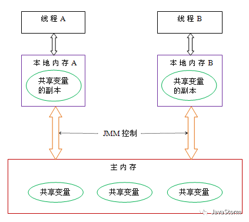

# volatile底层原理

一个字段被volatile修饰，Java的内存模型确保所有的线程看到的这个变量值是一致的，但是它并不能保证多线程的原子操作。这就是所谓的线程可见性。我们要知道他是不能保证原子性的

## 内存模型
Java线程之间的通信由Java内存模型(JMM)控制，JMM决定一个线程对共享变量的修改何时对另外一个线程可见。JMM定义了线程与主内存的抽象关系：线程之间的变量存储在主内存(Main Memory)中，每个线程都有一个私有的本地内存(Local Memory)保存着共享变量的副本。本地内存是JMM的一个抽象概念，并不真实存在。



如果线程A与线程B通信：
1. 线程A要先把本地内存A中更新过的共享变量刷写到主内存中。
2. 线程B到主内存中读取线程A更新后的共享变量


计算机在运行程序时，每条指令都是在CPU中执行的，在执行过程中势必会涉及到数据的读写。我们知道程序运行的数据是存储在主存中，这时就会有一个问题，读写主存中的数据没有CPU中执行指令的速度快，所以就有了CPU高速缓存。CPU高速缓存为某个CPU独有，只与在该CPU运行的线程有关。
有了CPU高速缓存虽然解决了效率问题，但是它会带来一个新的问题：数据一致性。在程序运行中，会将运行所需要的数据复制一份到CPU高速缓存中，在进行运算时CPU不再也主存打交道，而是直接从高速缓存中读写数据，只有当运行结束后才会将数据刷新到主存中

解决缓存一致性方案有两种：
- 通过在总线加LOCK#锁的方式；它是采用一种独占的方式来实现的，即总线加LOCK#锁的话，只能有一个CPU能够运行，其他CPU都得阻塞，效率较为低下。
- 通过缓存一致性协议。缓存一致性协议（MESI协议）它确保每个缓存中使用的共享变量的副本是一致的。所以JMM就解决这个问题。

## volatile实现原理
有volatile修饰的共享变量进行写操作的时候会多出Lock前缀的指令，该指令在多核处理器下会引发两件事情。
1. 将当前处理器缓存行数据刷写到系统主内存。
2. 这个刷写回主内存的操作会使其他CPU缓存的该共享变量内存地址的数据无效。
这样就保证了多个处理器的缓存是一致的，对应的处理器发现自己缓存行对应的内存地址被修改，就会将当前处理器缓存行设置无效状态，当处理器对这个数据进行修改操作的时候会重新从主内存中把数据读取到缓存里。

## 使用场景：状态标记
很多人在中断线程时可能都会采用这种标记办法。
每个线程在运行过程中都有自己的工作内存，那么线程1在运行的时候，会将stop变量的值拷贝一份放在自己的工作内存当中。
那么当线程2更改了stop变量的值之后，但是还没来得及写入主存当中，线程2转去做其他事情了，那么线程1由于不知道线程2对stop变量的更改，因此还会一直循环下去。
```java

//线程1
boolean stop = false;
while(!stop){
   doSomething();
}

//线程2
stop = true;

```


## 使用场景：double check
```java
public class Singleton{
   private volatile static Singleton instance = null;

   private Singleton() {

  }

   public static Singleton getInstance() {
       if(instance==null) {
           synchronized (Singleton.class) {
               if(instance==null)
                   instance = new Singleton();
          }
      }
       return instance;
  }
}
```