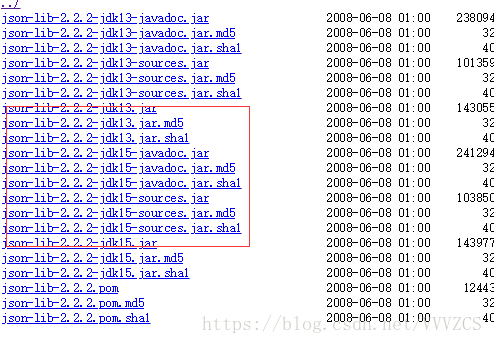
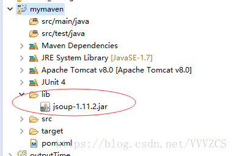
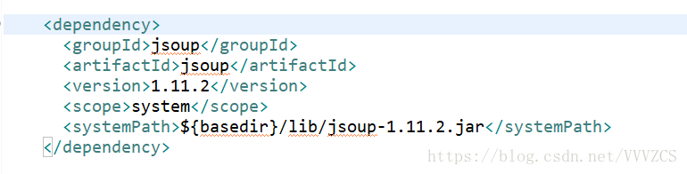
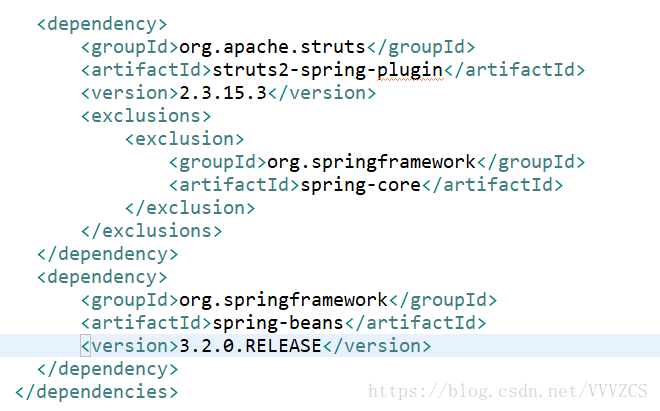

# 简介
Maven仓库就是放置所有JAR文件（WAR，ZIP，POM等等）的地方，所有Maven项目可以从同一个Maven仓库中获取自己所需要的依赖JAR，这节省了磁盘资源。此外，由于Maven仓库中所有的JAR都有其自己的坐标，该坐标告诉Maven它的组ID，构件ID，版本，打包方式等等，因此Maven项目可以方便的进行依赖版本管理

## 仓库
运行Maven的时候，Maven所需要的任何构件都是直接从本地仓库获取的。如果本地仓库没有，它会首先尝试从远程仓库下载构件至本地仓库，然后再使用本地仓库的构件。如果尝试过所有远程仓库之后，Maven还是没能够下载到该文件，它就会报错。
Maven缺省的本地仓库地址为`${user.home}/.m2/repository` 。也就是说，一个用户会对应的拥有一个本地仓库。

### 配置本地仓库
可以自定义本地仓库的位置，修改${user.home}/.m2/settings.xml ：
```xml
  <!-- localRepository
   | The path to the local repository maven will use to store artifacts.
   |
   | Default: ${user.home}/.m2/repository-->
  <localRepository>D:/.m2/repository</localRepository>
```
还可以在运行时指定本地仓库位置：
mvn clean install -Dmaven.repo.local=/home/juven/myrepo/

> 当我们运行install的时候，Maven实际上是将项目生成的构件安装到了本地仓库，也就是说，只有install了之后，其它项目才能使用此项目生成的构件。


### 默认中央仓库
maven安装目录下的：/lib/maven-model-builder-${version}.jar中

打开该文件，能找到超级POM：\org\apache\maven\model\pom-4.0.0.xml ，它是所有Maven POM的父POM，所有Maven项目继承该配置，你可以在这个POM中发现如下配置：
```xml
 <repositories>
    <repository>
      <id>central</id>
      <name>Central Repository</name>
      <url>https://repo.maven.apache.org/maven2</url>
      <layout>default</layout>
      <snapshots>
        <enabled>false</enabled>
      </snapshots>
    </repository>
  </repositories>
```
中央仓库的id为central，远程url地址为http://repo.maven.apache.org/maven2，它关闭了snapshot版本构件下载的支持

### 在POM中配置远程仓库
比如你有一个局域网的远程仓库，使用该仓库能大大提高下载速度，继而提高构建速度，也有可能你依赖的一个jar在central中找不到，它只存在于某个特定的公共仓库，这样你也不得不添加那个远程仓库的配置。

```xml
<repositories>
<!--用来配置maven项目的远程仓库. 每个<repository>都有它唯一的ID，一个描述性的name，以及远程仓库的url -->
<repository>
    <id>maven-net-cn</id>
    <name>Maven China Mirror</name>
    <url>http://maven.net.cn/content/groups/public/</url>
    <!-- 可以从这个仓库下载releases版本的构件 -->
    <releases>
    <enabled>true</enabled>
    </releases>
    <!-- 不要从这个仓库下载snapshot版本的构件 -->
    <snapshots>
    <enabled>false</enabled>
    </snapshots>
</repository>
</repositories>

<pluginRepositories>
<!-- 用来配置maven插件的远程仓库 -->
<pluginRepository>
    <id>maven-net-cn</id>
    <name>Maven China Mirror</name>
    <url>http://maven.net.cn/content/groups/public/</url>
    <releases>
    <enabled>true</enabled>
    </releases>
    <snapshots>
    <enabled>false</enabled>
    </snapshots>    
</pluginRepository>
</pluginRepositories>
```

### 在settings.xml中配置远程仓库
定义一个id为dev的profile，将所有repositories以及pluginRepositories元素放到这个profile中，然后，激活该profile。这样，你就不用再为每个POM重复配置仓库。
使用profile为settings.xml添加仓库提供了一种用户全局范围的仓库配置。
```xml
<profiles>
    <profile>
        <id>dev</id>
        <!-- repositories and pluginRepositories here-->
    </profile>
</profiles>
<activeProfiles>
    <activeProfile>dev</activeProfile>
</activeProfiles>
```

### 在settings.xml中使用镜像
如果你的地理位置附近有一个速度更快的central镜像，或者你想覆盖central仓库配置，或者你想为所有POM使用唯一的一个远程仓库（这个远程仓库代理的所有必要的其它仓库），你可以使用settings.xml中的mirror配置。
以下的mirror配置用maven.NET.cn覆盖了Maven自带的central：
```xml
<mirrors>
    <mirror>
        <id>maven-net-cn</id>
        <name>Maven China Mirror</name>
        <url>http://maven.net.cn/content/groups/public/</url>
        <mirrorOf>central</mirrorOf>
    </mirror>
</mirrors>
```

### 分发构件至远程仓库
mvn deploy用来将项目生成的构件分发到远程Maven仓库。本地Maven仓库的构件只能供当前用户使用，在分发到远程Maven仓库之后，所有能访问该仓库的用户都能使用你的构件
配置POM的distributionManagement来指定Maven分发构件的位置
```xml
<distributionManagement>    
<!-- snapshot为开发过程中的版本，实时，但不稳定，release版本则比较稳定。Maven会根据你项目的版本来判断将构件分发到哪个仓库 -->
    <repository>    
      <id>nexus-releases</id>    
      <name>Nexus Release Repository</name>    
      <url>http://127.0.0.1:8080/nexus/content/repositories/releases/</url>    
    </repository>    
    <snapshotRepository>    
      <id>nexus-snapshots</id>    
      <name>Nexus Snapshot Repository</name>    
      <url>http://127.0.0.1:8080/nexus/content/repositories/snapshots/</url>    
    </snapshotRepository>    
  </distributionManagement>    
```

一般来说，分发构件到远程仓库需要认证。如下在settings.xml中配置认证信息：
```xml
<servers>    
<!-- server元素下id的值必须与POM中repository或snapshotRepository下id的值完全一致。将认证信息放到settings下而非POM中，是因为POM是可见的，而settings.xml是本地的。 -->
    <server>    
      <id>nexus-releases</id>    
      <username>admin</username>    
      <password>admin123</password>    
    </server>    
    <server>    
      <id>nexus-snapshots</id>    
      <username>admin</username>    
      <password>admin123</password>    
    </server>      
</servers>    
```

## <dependency
groupId，artfactId，version，type，classifier，scope，systemPath，exclusions，optional 是 maven的9种依赖属性，

其中groupId，artfactId，version是三个基本的依赖坐标，不可缺少。

1. groupId------包名（一般为域名的反写）。

2. artfactId------项目名。

3. version-------版本。

4. type----------依赖的类型，jar或者war（默认为jar，表示依赖的是一个jar包），另外当type表示为pom.lastUpdated性时，表示只将jar的描述信息加载了进来，实际的jar包并未导入。

5. classifier----通常是用于从同一POM构建的不同内容的构件，可选属性，可以是任意的字符串。对附加了classifier属性的包，如果不加上classifier，maven是找不到这个包的，比如下面这个依赖：
```xml
<dependency>  
     <groupId>net.sf.json-lib</groupId>   
     <artifactId>json-lib</artifactId>   
     <version>2.2.2</version>  
</dependency> 
```

发现中央仓库中并没有json-lib-2.2.2.jar这个包 ，有的只是不同版本的json-lib-2.2.2.jar，这个时候classifier就可以指明所想要版本。
```xml
<dependency>  
     <groupId>net.sf.json-lib</groupId>   
     <artifactId>json-lib</artifactId>   
     <version>2.2.2</version>
     <classifier>jdk15</classifier>
</dependency>  
```
这样就可以找到json-lib-2.2.2-jdk15.jar这个包

classifier不仅可以指明版本号，可以指明同一项目的不同组成部分，比如：源文件，javadoc，类文件等。在上面的图中你会发现还有一些json-lib-2.2.2-jdk15-javadoc.jar包和json-lib-2.2.2-jdk15-source.jar包，如果你需要的是javadoc，在XML文档中就可以这样写：
```xml
<dependency>  
     <groupId>net.sf.json-lib</groupId>   
     <artifactId>json-lib</artifactId>   
     <version>2.2.2</version>
     <classifier>jdk15-javadoc</classifier>
</dependency>  
```
同理，如果你需要的时候source包就可以把classifier写成  jdk15-source 。

6. scope-----依赖作用的范围，指通过POM加载进来的包，作用的范围.
scope一共有compile，runtime，test，system，provided 5种属性值，compile为其默认值，其中：
- compile表示在所有范围此jar都生效，
- test表示只在测试范围此jar生效，例如Junit（默认compile，不会报错，扩展了test），
- runtime表示在测试和运行时此jar生效，例如JDBC驱动（默认compile，不会报错，扩展了runtime），我们在编译时是没有用到这个包的，只在测试和运行时会使用到，
- provided表示在编译和测试时此jar生效，例如servlet-api，jsp-api，这个的provided必须填写，不能使用compile，原因: 如果设置了compile，在Tomcat中运行时，就会与Tomcat中提供的这两个包产生冲突，所以要设置为provided，

7. system表示我们手动添加的包，不属于maven仓库，属于别的类库的jar包，只在编译和测试期生效，运行时无效，使用时，需要配合下面的systemPath使用。
systemPath--为并非依赖maven的包指明路径。

在项目中创建一个lib作为手动导入的jar包存储位置(basedir表示根目录)




> Maven 中的依赖关系是有传递性的。例如：项目B依赖项目C（B —> C），如果有一个项目A依赖项目B（A —> B）的话，那么项目A也会依赖项目C（A —> C）。虽然，这种依赖的自动传递性给我们维护项目的必要依赖关系带来了极大地帮助，但当我们在某些情况下，需要在项目A中排除对项目C的依赖时，这时又该怎么做呢？Maven 为我们提供了两种解决方案，分别是可选依赖（Optional Dependencies）和依赖排除（Dependency Exclusions）。


8. exclusions---排除传递依赖，解决jar冲突问题。
例如：A项目依赖B（版本为1.1），C项目也依赖B（版本为1.2），假如现在有一个项目同时依赖项目A和项目B，那么他就会导入两个版本的B，由于B的两个版本不同，这里就会导致冲突，这个时候就需要exclusions来解决冲突


9. optional-----标记依赖是否可传递，默认值false.
应用场景：假设有一个项目X，它实现了类似Hibernate的功能，支持很多种数据库驱动，例如：mysql，oracle等。我们在构建项目X的时候，确实需要所有这些依赖。但设想，假如有一个项目Y想使用项目X提供的功能，那么它极有可能只使用其中的一种数据库驱动。这个时候，就需要我们在项目X中将所有和驱动相关的依赖设置为可选依赖。只有这样，在项目Y中声明项目X为直接依赖的时候，才不会将项目X的所有关于驱动的依赖自动引入。这时，项目Y只需要额外声明自己真正需要依赖的驱动即可


## <dependencyManagement
通过它来管理jar包的版本，让子项目中引用一个依赖而不用显示的列出版本号。

pom.xml文件中，jar的版本判断的两种途径
1. 如果dependencies里的dependency自己没有声明version元素，那么maven就
会倒dependencyManagement里面去找有没有对该artifactId和groupId进行过版本声明，如果有，就继承它，如果没有就会报错，告诉你必须为dependency声明一个version
2. 如果dependencies中的dependency声明了version，那么无论dependencyManagement中有无对该jar的version声明，都以dependency里的version为准
```xml
<!-- 只是对版本进行管理，不会实际引入jar   -->
<dependencyManagement>  
      <dependencies>  
            <dependency>  
                <groupId>org.springframework</groupId>  
                <artifactId>spring-core</artifactId>  
                <version>3.2.7</version>  
            </dependency>  
    </dependencies>  
</dependencyManagement>  
  
<!-- 会实际下载jar包   -->
<dependencies>  
       <dependency>  
                <groupId>org.springframework</groupId>  
                <artifactId>spring-core</artifactId>  
       </dependency>  
</dependencies>
```

