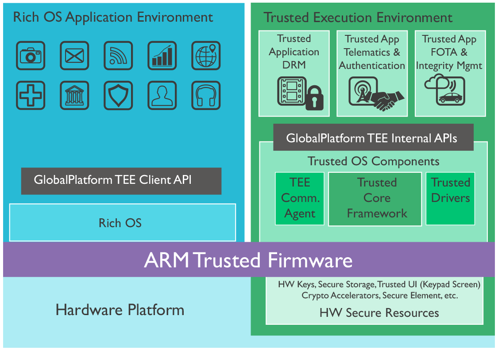

# 简介
Trustzone 是 ARM 公司为了解决可能遇到的软硬件安全问题提出的一种硬件解决方案。基于 Trustzone 这种硬件架构设计的软硬件，能在很大程度和范围内保证系统的安全性，使软硬件破解都变得相对很困难。

这套硬件架构的核心设计思想，关键词在于“隔离”。简单描述就是人为将系统运行环境划分为 TEE (Trusted Execution Environment) 和 REE ( Rich Execution Environment)，所有的安全资源只能由 TEE 访问，而 REE 根本touch 不到。TEE 中运行的通常被认为是 trusted OS，一般为独立的 binary。REE 中运行的 rich OS 大多是指常用的 Linux 和 Android 操作系统。直观的例子就是 Android 系统下的各个应用是无法直接访问指纹信息的，只有切换到 Trusted OS 下才可以访问。

从最简单抽象的层面来一句话介绍TrustZone就是，将一个物理处理器分时复用为两个逻辑处理器，一半是Rich Execution Environment 另一半是Trusted Execution Environment。

# 基于TrustZone的应用

TEE环境下也要有一个操作系统，各家都有自己的Trustzone的操作系统，如Trustonic、高通的QSEE、国内的豆荚，还有开源的OPTEE等。在操作系统之上自然要有应用程序，在Trustzone里面我们一般叫TrustApp，当然TEE里面每个TrustApp都在一个沙盒里，互相之间是隔离的。比如说支付，就可以做成一个App（需要注意的是，和Normal World里面的App是两个概念），这个App简单来说就负责用私钥把网上发来的Challenge签个名，而这个签名的动作是需要在Secure World里面做的，避免恶意程序窃取到私钥来伪造签名。

现在的Trust OS大都会遵循GlobalPlatform的规范，这个组织致力于制定统一的Trust OS的API的接口规范，这样一个TrustApp只要用GP API，就可以方便移植到各个不同的TEE操作系统上了

# 系统模式切换
基于TrustZone的系统有三种状态，安全世界、非安全世界和用于二者切换的Monitor Mode。

协处理器CP15的寄存器SCR(Secure Configuration Register)有一个NS位用于指示当前处理器位于哪一个世界，该寄存器在非安全世界是不能访问的。当CPU处于Monitor Mode时，无论NS位是0还是1，处理器都是在安全世界运行代码。因此Monitor Mode下总是安全世界，但如果此时NS为1，访问CP15的其它寄存器获取到的是其在非安全世界的值。

## 非安全世界到Monitor模式的切换
处理器从非安全世界进入Monitor Mode的操作由系统严格控制，而且所有这些操作在Monitor Mode看来都属于异常。 
从非安全世界到Monitor Mode的操作可通过以下方式触发：

- 软件执行SMC (Secure Monitor Call)指令
- 硬件异常机制的一个子集（换而言之，并非所有硬件异常都可以触发进入Monitor Mode），包括： 
    - IRQ
    - FIQ
    - external Data Abort
    - external Prefetch Abort
    
## Monitor Mode
Monitor Mode内执行的代码依赖于具体的实现，其功能类似于进程切换，不同的是这里是不同模式间CPU状态切换。

软件在Monitor Mode下先保存当前世界的状态，然后恢复下一个世界的状态。操作完成后以从异常返回的方式开始运行下一个世界的代码。

## 为什么安全模式和非安全模式不能直接切换？
非安全世界无权访问CP15的SCR寄存器，所以无法通过设置NS来直接切换到安全世界，只能先转换到Monitor Mode，再到安全世界。

如果软件运行在安全世界(非Monitor Mode)下，通过将CP15的NS位置1，安全世界可以直接跳转到非安全世界，由于此时CPU的流水线和寄存器还遗留了安全世界的数据和设置，非安全模式下的应用可以获取到这些数据，会有极大的安全风险。因此，只建议在Monitor Mode下通过设置NS位来切换到非安全模式。

> 安全世界和非安全世界不存在直接的切换，所有切换操作都通过Monitor Mode来执行。

# AXI 系统总线
trustzone 技术会将系统划分为两种模式：secure 和 Non-secure。而划分的基础就是 AXI 系统总线一条控制线的电平高低。简单来说，就是 ARM 为 AXI 总线每个信道的读写操作都新增了一个标记位：NS bit。主设备为Non-secure 状态时，发起读写请求，NS bit 必须置为高电平；主设备为 Secure 状态时，发起读写请求，NS bit 必须置为低电平。
APB 外围总线通过 AXI-to-APB bridge 连接到系统总线，可以实现对外设的安全访问管控，这里的外设可以包括 interrupt controller，timer 等。

# 安全启动
AMBA3 AXI总线机制隔离出安全世界和非安全世界，但这是系统启动之后的事情。如何确保系统本身是安全的呢？这就涉及到系统启动的过程。

系统上电复位后，先从安全世界开始执行。安全世界会对非安全世界的bootloader进行验证，确保非安全世界执行的代码经过授权而没有被篡改过。然后非安全世界的bootloader会加载非安全世界的OS，完成整个系统的启动。

在非安全系统的bootloader加载OS时，仍然需要安全世界对OS的代码进行验证，确保没有被篡改
