## 简介
springcloud zuul包含了对请求的路由和过滤两个功能，其中路由功能负责将外部请求转发到具体的微服务实例上，是实现外部访问统一入口的基础；而过滤器功能则负责对请求的处理过程进行干预，是实现请求校验，服务聚合等功能的基础。然而实际上，路由功能在真正运行时，它的路由映射和请求转发都是由几个不同的过滤器完成的。其中，**路由映射主要通过pre类型的过滤器完成，它将请求路径与配置的路由规则进行匹配，以找到需要转发的目标地址；而请求转发的部分则是由route类型的过滤器来完成，对pre类型过滤器获得的路由地址进行转发。所以说，过滤器可以说是zuul实现api网关功能最核心的部件**，每一个进入zuul的http请求都会经过一系列的过滤器处理链得到请求响应并返回给客户端。

## 配置

```yml
zuul: #用来构造ZuulProperties对象
#需要忽略的头部信息，不在传播到其他服务
  sensitive-headers: Access-Control-Allow-Origin
  ignored-headers: Access-Control-Allow-Origin,H-APP-Id,Token,APPToken

  ignored-services: '*'
  routes:
    #签章服务
    pms-pdfsigner: #id
      path: /pms-pdfsigner/**  #path
      serviceId: pms-pdfsigner  #serivceId
```

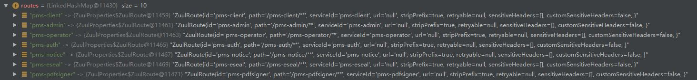


## Filter
1. pre:可以在请求被路由之前调用
2. routing:在请求时被调用
3. post:在routing和error过滤之后调用。
4. error：处理请求时发生错误是被调用。

`com.netflix.zuul.http.ZuulServlet`的`service`方法实现也可以看出，Zuul处理外部请求过程时，各个类型过滤器的执行逻辑：
```java
try {
    preRoute();
} catch (ZuulException e) {
    error(e);
    postRoute();
    return;
}
try {
    route();
} catch (ZuulException e) {
    error(e);
    postRoute();
    return;
}
try {
    postRoute();
} catch (ZuulException e) {
    error(e);
    return;
}
```
从代码中可以看到三个try-catch块，它们依次分别代表了pre、route、post三个阶段的过滤器调用，在catch的异常处理中都会被error类型的过滤器进行处理。error类型的过滤器处理完毕之后，除了来自post阶段的异常之外，都会再被post过滤器进行处理。

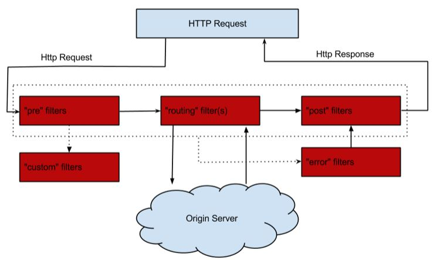

`com.netflix.zuul.ZuulFilter`的`runFilter`方法,过滤器的执行：
```java
public ZuulFilterResult runFilter() {
        ZuulFilterResult zr = new ZuulFilterResult();
        if (!isFilterDisabled()) {
            if (shouldFilter()) {
                Tracer t = TracerFactory.instance().startMicroTracer("ZUUL::" + this.getClass().getSimpleName());
                try {
                    Object res = run();
                    zr = new ZuulFilterResult(res, ExecutionStatus.SUCCESS);
                } catch (Throwable e) {
                    t.setName("ZUUL::" + this.getClass().getSimpleName() + " failed");
                    zr = new ZuulFilterResult(ExecutionStatus.FAILED);
                    zr.setException(e);
                } finally {
                    t.stopAndLog();
                }
            } else {
                zr = new ZuulFilterResult(ExecutionStatus.SKIPPED);
            }
        }
        return zr;
    }
```


### 自定义Zuul过滤器
定义一个简单的Zuul过滤器，它实现了在请求被路由之前检查HttpServletRequest中是否有accessToken参数，若有就进行路由，若没有就拒绝访问，返回401 Unauthorized错误。
```java
@Component
public class AccessFilter extends ZuulFilter {

    private static Logger log = LoggerFactory.getLogger(AccessFilter.class);

    @Override
    public String filterType() {
        return "pre";
    }

    //过滤器的执行顺序。当请求在一个阶段中存在多个过滤器时，需要根据该方法返回的值来依次执行
    @Override
    public int filterOrder() {
        return 0;
    }

    //判断该过滤器是否需要被执行。这里直接返回了true，因此该过滤器对所有请求都会生效。实际运用中可以利用该函数来指定过滤器的有效范围
    @Override
    public boolean shouldFilter() {
        return true;
    }

    //过滤器的具体逻辑。这里通过ctx.setSendZuulResponse(false)令zuul过滤该请求，不对其进行路由
    @Override
    public Object run() {
        RequestContext ctx = RequestContext.getCurrentContext();
        HttpServletRequest request = ctx.getRequest();

        log.info("send {} request to {}", request.getMethod(), request.getRequestURL().toString());

        Object accessToken = request.getParameter("accessToken");
        if (accessToken == null) {
            log.warn("access token is empty");
            ctx.setSendZuulResponse(false);
            ctx.setResponseStatusCode(401);
            ctx.setResponseBody("miss token");
            return null;
        }
        log.info("access token ok");
        return null;
    }
}
```

## pre filter

### 1. ServletDetectionFilter
执行顺序为-3，是最先被执行的过滤器。
该过滤器总是会被执行，主要用来检测当前请求是通过`Spring`的`DispatcherServlet`处理运行的，还是通过`ZuulServlet`来处理运行的。它的检测结果会以布尔类型保存在当前请求上下文的`isDispatcherServletRequest`参数中，这样后续的过滤器中，可以通过`RequestUtils.isDispatcherServletRequest()`和`RequestUtils.isZuulServletRequest()`方法来判断请求处理的源头，以实现后续不同的处理机制。一般情况下，发送到api网关的外部请求都会被`Spring`的`DispatcherServlet`处理，除了通过`/zuul/`路径访问的请求会绕过`DispatcherServlet`，被`ZuulServlet`处理，主要用来应对大文件上传的情况。另外，对于ZuulServlet的访问路径`/zuul/*`，我们可以通过`zuul.servletPath`参数进行修改。


### 2. Servlet30WrapperFilter
执行顺序为-2，是第二个执行的过滤器，目前的实现会对所有请求生效，主要为了将原始的`HttpServletRequest`包装成`Servlet30RequestWrapper`对象。
```java
public Object run() {
		RequestContext ctx = RequestContext.getCurrentContext();
		HttpServletRequest request = ctx.getRequest();
		if (request instanceof HttpServletRequestWrapper) {
			request = (HttpServletRequest) ReflectionUtils.getField(this.requestField,
					request);
			ctx.setRequest(new Servlet30RequestWrapper(request));
		}
		else if (RequestUtils.isDispatcherServletRequest()) {
			// If it's going through the dispatcher we need to buffer the body
			ctx.setRequest(new Servlet30RequestWrapper(request));
		}
		return null;
	}
```


### 3. RateLimitPreFilter


### 4. FormBodyWrapperFilter
执行顺序为-1。该过滤器仅对两类请求生效，第一类是`Context-Type`为`application/x-www-form-urlencoded`的请求，第二类是`Context-Type`为`multipart/form-data`并且是由`DispatcherServlet`处理的请求（用到了`ServletDetectionFilter`的处理结果）。而该过滤器的主要目的是将符合要求的请求体包装成`FormBodyRequestWrapper`对象。

```java
public Object run() {
		RequestContext ctx = RequestContext.getCurrentContext();
		HttpServletRequest request = ctx.getRequest();
		FormBodyRequestWrapper wrapper = null;
		if (request instanceof HttpServletRequestWrapper) {
			HttpServletRequest wrapped = (HttpServletRequest) ReflectionUtils
					.getField(this.requestField, request);
			wrapper = new FormBodyRequestWrapper(wrapped);
			ReflectionUtils.setField(this.requestField, request, wrapper);
			if (request instanceof ServletRequestWrapper) {
				ReflectionUtils.setField(this.servletRequestField, request, wrapper);
			}
		}
		else {
			wrapper = new FormBodyRequestWrapper(request);
			ctx.setRequest(wrapper);
		}
		if (wrapper != null) {
			ctx.getZuulRequestHeaders().put("content-type", wrapper.getContentType());
		}
		return null;
	}
```

### 5. DebugFilter
执行顺序为1，该过滤器会根据配置参数`zuul.debug.request`和请求中的`debug`参数来决定是否执行过滤器中的操作。而它的具体操作内容是将当前请求上下文中的`debugRouting`和`debugRequest`参数设置为`true`。由于在同一个请求的不同生命周期都可以访问到这二个值，所以我们在后续的各个过滤器中可以利用这二个值来定义一些debug信息，这样当线上环境出现问题的时候，可以通过参数的方式来激活这些debug信息以帮助分析问题，另外，对于请求参数中的debug参数，我们可以通过`zuul.debug.parameter`来进行自定义


### 6. PreDecorationFilter
执行顺序是5，是pre阶段最后被执行的过滤器，该过滤器会判断当前请求上下文中是否存在`forward.do`和`serviceId`参数，如果都不存在，那么它就会执行具体过滤器的操作（如果有一个存在的话，说明当前请求已经被处理过了，因为这二个信息就是根据当前请求的路由信息加载进来的）。

```java
public boolean shouldFilter() {
    RequestContext ctx = RequestContext.getCurrentContext();
    return !ctx.containsKey(FORWARD_TO_KEY) // a filter has already forwarded
            && !ctx.containsKey(SERVICE_ID_KEY); // a filter has already determined serviceId
}
```
具体操作内容就是为当前请求做一些预处理，比如说，进行路由规则的匹配，在请求上下文中设置该请求的基本信息以及将路由匹配结果等一些设置信息等，这些信息将是后续过滤器进行处理的重要依据，可以通过`RequestContext.getCurrentContext()`来访问这些信息。另外，还可以在该实现中找到对HTTP头请求进行处理的逻辑，比如`X-Forwarded-Host,X-Forwarded-Port`。另外，对于这些头域是通过`zuul.addProxyHeaders`参数进行控制的，而这个参数默认值是`true`，所以zuul在请求跳转时默认会为请求增加`X-Forwarded-*`头域，包括`X-Forwarded-Host,X-Forwarded-Port，X-Forwarded-For，X-Forwarded-Prefix,X-Forwarded-Proto`。也可以通过设置`zuul.addProxyHeaders=false`关闭对这些头域的添加动作。

```java
public Object run() {
    RequestContext ctx = RequestContext.getCurrentContext();
    final String requestURI = this.urlPathHelper.getPathWithinApplication(ctx.getRequest());
    Route route = this.routeLocator.getMatchingRoute(requestURI);
    if (route != null) {
        String location = route.getLocation();
        if (location != null) {
            ctx.put(REQUEST_URI_KEY, route.getPath());
            ctx.put(PROXY_KEY, route.getId());
            if (!route.isCustomSensitiveHeaders()) {
                this.proxyRequestHelper
                        .addIgnoredHeaders(this.properties.getSensitiveHeaders().toArray(new String[0]));
            }
            else {
                this.proxyRequestHelper.addIgnoredHeaders(route.getSensitiveHeaders().toArray(new String[0]));
            }

            if (route.getRetryable() != null) {
                ctx.put(RETRYABLE_KEY, route.getRetryable());
            }

            if (location.startsWith(HTTP_SCHEME+":") || location.startsWith(HTTPS_SCHEME+":")) {
                ctx.setRouteHost(getUrl(location));
                ctx.addOriginResponseHeader(SERVICE_HEADER, location);
            }
            else if (location.startsWith(FORWARD_LOCATION_PREFIX)) {
                ctx.set(FORWARD_TO_KEY,
                        StringUtils.cleanPath(location.substring(FORWARD_LOCATION_PREFIX.length()) + route.getPath()));
                ctx.setRouteHost(null);
                return null;
            }
            else {
                // set serviceId for use in filters.route.RibbonRequest
                ctx.set(SERVICE_ID_KEY, location);
                ctx.setRouteHost(null);
                ctx.addOriginResponseHeader(SERVICE_ID_HEADER, location);
            }
            if (this.properties.isAddProxyHeaders()) {
                addProxyHeaders(ctx, route);
                String xforwardedfor = ctx.getRequest().getHeader(X_FORWARDED_FOR_HEADER);
                String remoteAddr = ctx.getRequest().getRemoteAddr();
                if (xforwardedfor == null) {
                    xforwardedfor = remoteAddr;
                }
                else if (!xforwardedfor.contains(remoteAddr)) { // Prevent duplicates
                    xforwardedfor += ", " + remoteAddr;
                }
                ctx.addZuulRequestHeader(X_FORWARDED_FOR_HEADER, xforwardedfor);
            }
            if (this.properties.isAddHostHeader()) {
                ctx.addZuulRequestHeader(HttpHeaders.HOST, toHostHeader(ctx.getRequest()));
            }
        }
    }
    else {
        log.warn("No route found for uri: " + requestURI);
        String forwardURI = getForwardUri(requestURI);

        ctx.set(FORWARD_TO_KEY, forwardURI);
    }
    return null;
}
```


## route filters

### 1. RibbonRoutingFilter
它的执行顺序为10，是route阶段的第一个执行的过滤器。该过滤器只对请求上下文中存在`serviceId`参数的请求进行处理，即只对通过serviceId配置路由规则的请求生效。而该过滤器的执行逻辑就是面向服务路由的核心，它通过使用ribbon和hystrix来向服务实例发起请求，并将服务实例的请求结果返回。


```java
public boolean shouldFilter() {
    RequestContext ctx = RequestContext.getCurrentContext();
    return (ctx.getRouteHost() == null && ctx.get(SERVICE_ID_KEY) != null
            && ctx.sendZuulResponse());
}
```
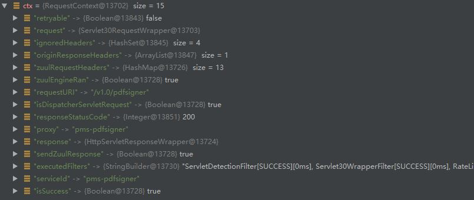


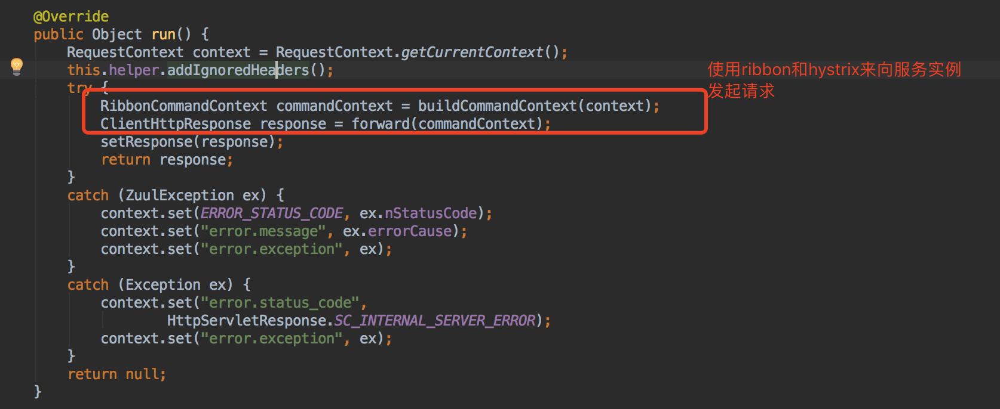

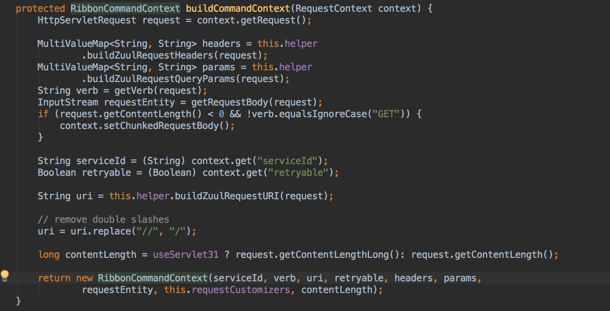

```java
protected ClientHttpResponse forward(RibbonCommandContext context) throws Exception {
    Map<String, Object> info = this.helper.debug(context.getMethod(),
            context.getUri(), context.getHeaders(), context.getParams(),
            context.getRequestEntity());

    RibbonCommand command = this.ribbonCommandFactory.create(context);
    try {
        ClientHttpResponse response = command.execute();
        this.helper.appendDebug(info, response.getRawStatusCode(), response.getHeaders());
        return response;
    }
    catch (HystrixRuntimeException ex) {
        return handleException(info, ex);
    }

}
```

command 开启一个future，执行AbstractRibbonCommand.run方法

```java
protected ClientHttpResponse run() throws Exception {
    final RequestContext context = RequestContext.getCurrentContext();

    RQ request = createRequest();
    RS response;
    
    boolean retryableClient = this.client instanceof AbstractLoadBalancingClient
            && ((AbstractLoadBalancingClient)this.client).isClientRetryable((ContextAwareRequest)request);
    
    if (retryableClient) {
        response = this.client.execute(request, config);
    } else {
        response = this.client.executeWithLoadBalancer(request, config);
    }
    context.set("ribbonResponse", response);

    // Explicitly close the HttpResponse if the Hystrix command timed out to
    // release the underlying HTTP connection held by the response.
    //
    if (this.isResponseTimedOut()) {
        if (response != null) {
            response.close();
        }
    }

    return new RibbonHttpResponse(response);
}
```

这里的client是AbstractLoadBalanceAwareClient->调用LoadBalancerCommand的submit方法
->调用RetryableRibbonLoadBalancingHttpClient的execute方法->CloseableHttpClient的execute方法->InternalHttpClient的doExecute方法-->RedirectExec的execute方法--> RetryExec的execute方法-->ProtocolExec的exec方法--> MainClientExec的execute方法--> HttpRequestExecutor的execute方法


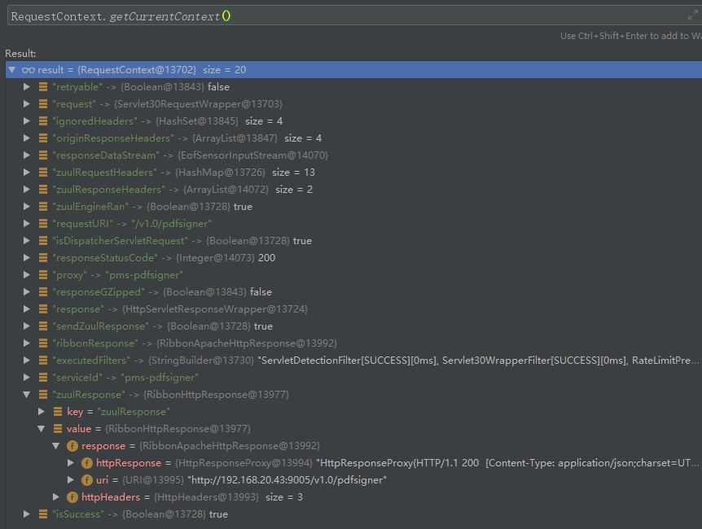


### 2. SimpleHostRoutingFilter

它的执行顺序为100，是route阶段的第二个执行的过滤器。该过滤器只对请求上下文存在`routeHost`参数的请求进行处理，即**只对通过url配置路由规则的请求生效。而该过滤器的执行逻辑就是直接向routeHost参数的物理地址发起请求**，该请求是直接通过httpclient包实现的，而没有使用Hystrix命令进行包装，所以这类请求并没有线程隔离和断路器的保护。


```java
public boolean shouldFilter() {
		return RequestContext.getCurrentContext().getRouteHost() != null
				&& RequestContext.getCurrentContext().sendZuulResponse();
	}
```
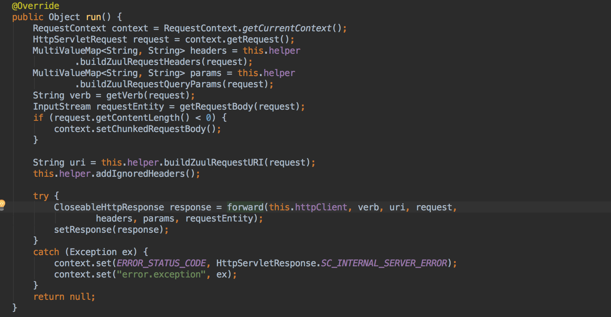
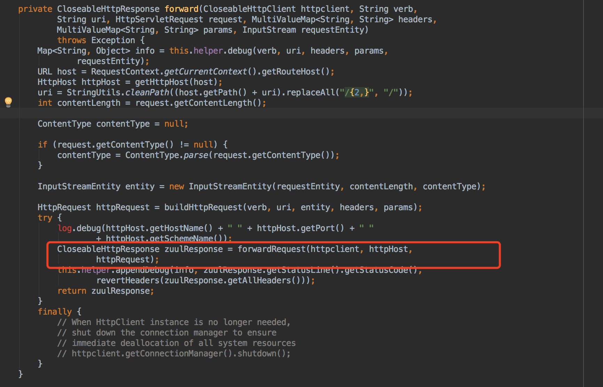
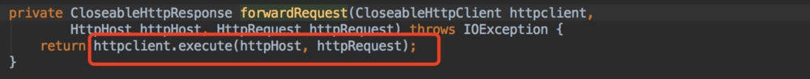


配置类似`zuul.routes.user-service.url=http://localhost:8080/`这样的底层都是通过httpclient直接发送请求的，也就知道为什么这样的情况没有做到负载均衡的原因所在。

### 3. SendForwardFilter
它的执行顺序是500，是route阶段第三个执行的过滤器。该过滤器只对请求上下文中存在的`forward.do`参数进行处理请求，即用来处理路由规则中的forward本地跳转装配。

```java
 public boolean shouldFilter() {
		RequestContext ctx = RequestContext.getCurrentContext();
		return ctx.containsKey(FORWARD_TO_KEY)
				&& !ctx.getBoolean(SEND_FORWARD_FILTER_RAN, false);
	}
```
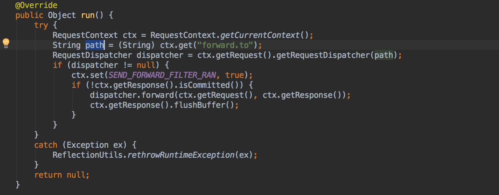


## post route filters
### 1. TracePostZuulFilter

```java
public boolean shouldFilter() {
    //执行失败了才调用
		return !httpStatusSuccessful(RequestContext.getCurrentContext().getResponse());
	}
```

### 2. SendErrorFilter
它的执行顺序是0，是post阶段的第一个执行的过滤器。该过滤器仅在请求上下文中包含`error.status_code`参数（由之前执行的过滤器设置的错误编码）并且还没有被该过滤器处理过的时候执行。而该过滤器的具体逻辑就是利用上下文中的错误信息来组成一个forward到api网关/error错误端点的请求来产生错误响应。

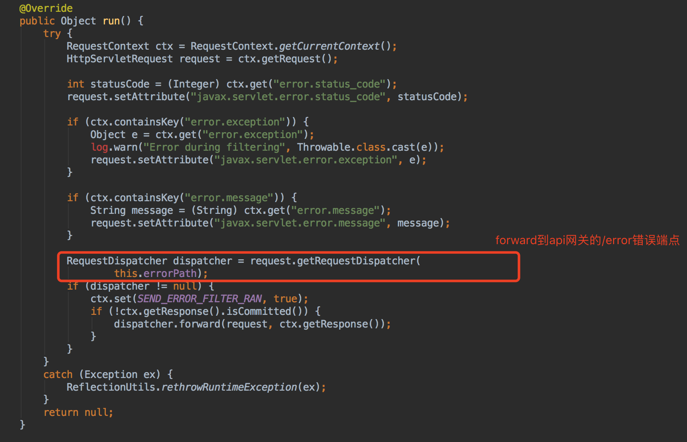

### 3. SendResponseFilter
它的执行顺序为1000，是post阶段最后执行的过滤器，该过滤器会检查请求上下文中是否包含请求响应相关的头信息，响应数据流或是响应体，只有在包含它们其中一个的时候执行处理逻辑。而该过滤器的处理逻辑就是利用上下文的响应信息来组织需要发送回客户端的响应内容


