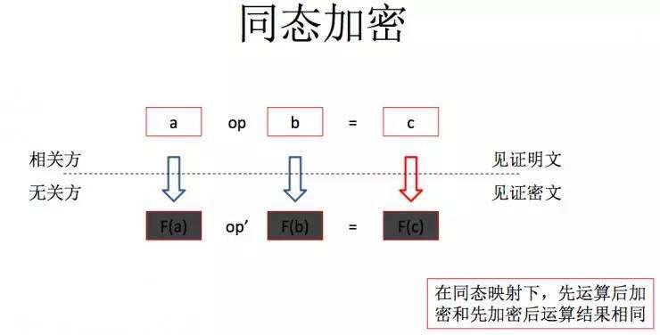
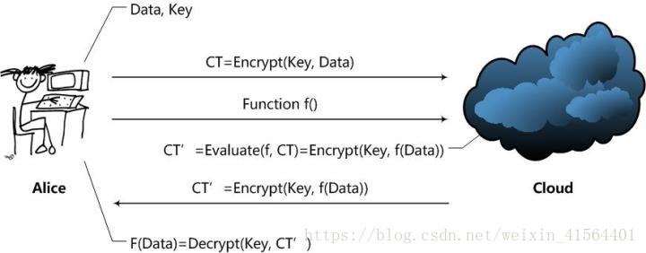
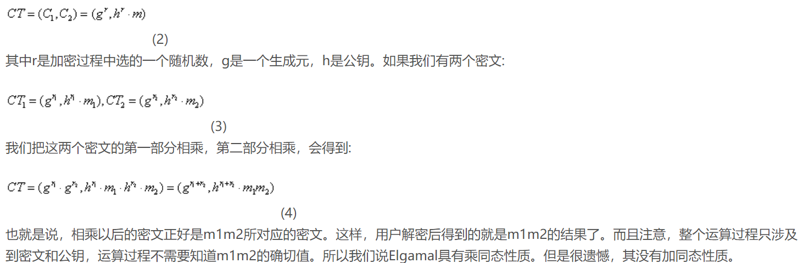
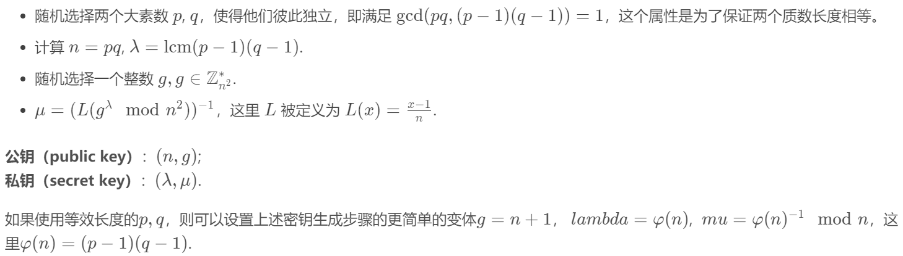
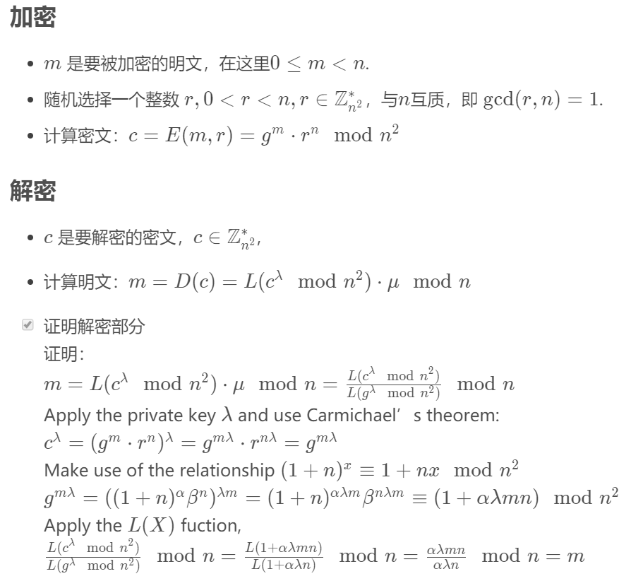
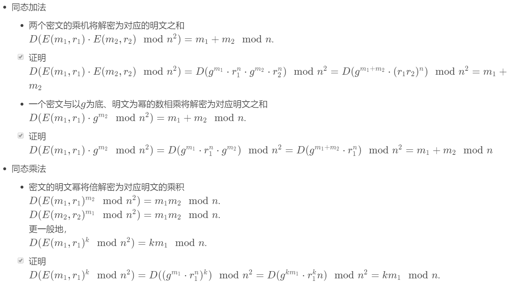

# Homomorphic Encryption
同态加密就是把密文按照某种规则进行操作后解密和直接按照某种规则操作明文得到的结果是一样的

假设有一个人希望找到所有员工工资的中位数。需要一个值得信赖的个人或团队可以获得员工的薪酬细节，这可能会侵犯隐私。然而，使用同态加密，可以在不解密数据，不暴露个人薪酬的情况下提取数字并得出中位数，一旦处理和解密，就只能看到最终数字。

特别是云计算可以从同态加密方案中受益，因为它们可以运行计算而无需访问原始未加密的数据。 其实，不仅对试图访问系统的外部参与者，还是对内部处理器来说，一个有效的同态加密模型意味着敏感数据的暴露少。

# 同态分类

# 同态加密的具体过程

Alice通过Cloud，以Homomorphic Encryption（以下简称HE）处理数据的整个处理过程大致是这样的：

1. Alice对数据进行加密。并把加密后的数据发送给Cloud；
2. Alice向Cloud提交数据的处理方法，这里用函数f来表示；
3. Cloud在函数f下对数据进行处理，并且将处理后的结果发送给Alice；
4. Alice对数据进行解密，得到结果。

一个HE方案应该拥有的函数：
- KeyGen函数：密钥生成函数。这个函数应该由Alice运行，用于产生加密数据Data所用的密钥Key。同时应该还有一些公开常数PP（Public Parameter）；
- Encrypt函数：加密函数。这个函数也应该由Alice运行，用Key对用户数据Data进行加密，得到密文；
- Evaluate函数：评估函数。这个函数由Cloud运行，在用户给定的数据处理方法f下，对密文进行操作，使得结果相当于用户用密钥Key对f(Data)进行加密。
- Decrypt函数：解密函数。这个函数由Alice运行，用于得到Cloud处理的结果f(Data)。

根据f的限制条件不同，HE方案实际上分为了两类：
- Fully Homomorphic Encryption (FHE)：这意味着HE方案支持任意给定的f函数，只要这个f函数可以通过算法描述，用计算机实现。显然，FHE方案是一个非常棒的方案，但是计算开销极大，暂时还无法在实际中使用。
- Somewhat Homomorphic Encryption (SWHE)：这意味着HE方案只支持一些特定的f函数。SWHE方案稍弱，但也意味着开销会变得较小，容易实现，现在已经可以在实际中使用。

# Elgamal加密方案--乘法同态性

# 应用--安全多方计算协议设计的工具
所谓安全多方计算就是分别持有私有数据 x1,x2,…,xn的 n 个人，在分布式环境中协同计算函数f (x1,x2,…,xn) 而不泄露各方的私有数据。以同态技术加密的密文数据计算不仅可以满足安全多方计算协议设计中保护各方隐私的需要。

# 应用 -- 投票
人的身份信息不被匿名，而是匿名他们的投票信息， 系统会自动把所有人的投票信息的密文进行处理得到一个密文，把这个密文丢给管理员，管理员对一个密文解密就可得到最终信息。

# BGN同态加密算法
BGN是一种同态加密方案，是Bonel h等人在2005提出的一种具有全同态性质的加密方案。和传统的仅能支持单同态的elgamal和paillier加密方案不一样，BGN能够同时支持`加同态和一次乘同态运算`。

由于乘法同态的实现是通过双线性对性质实现的，所以仅仅只能实现一次的乘同态

# Paillier 加法同态加密
## 密钥生成

## 加解密

## 同态证明

