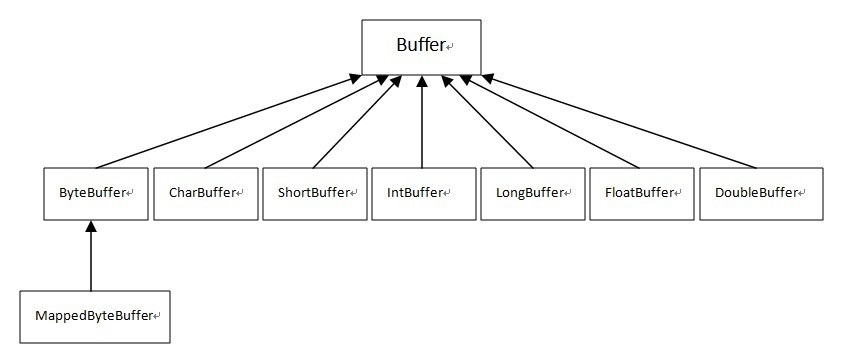

# 简介
字节流继承于InputStream、OutputStream，字符流继承于Reader、Writer。在java.io 包中还有许多其他的流，主要是为了提高性能和使用方便。关于Java的I/O需要注意的有两点：一是两种对称性（输入和输出的对称性，字节和字符的对称性）；二是两种设计模式（适配器模式和装潢模式）

```java
//文件拷贝
public static void fileCopy(String source, String target) throws IOException {
     try (InputStream in = new FileInputStream(source)) {
      try (OutputStream out = new FileOutputStream(target)) {
        byte[] buffer = new byte[4096];
        int bytesToRead;
        while((bytesToRead = in.read(buffer)) != -1) {
       out.write(buffer, 0, bytesToRead);
                }
            }
        }
    }
 
public static void fileCopyNIO(String source, String target) throws IOException {
   try (FileInputStream in = new FileInputStream(source)) {
      try (FileOutputStream out = new FileOutputStream(target)) {
    //在jdk1.4中，新增了NIO包，优化了一些IO处理的速度，所以在FileInputStream和FileOutputStream中新增了FileChannel getChannel()的方法。即获取与该文件输入流相关的 java.nio.channels.FileChannel对象。
       FileChannel inChannel = in.getChannel();
       FileChannel outChannel = out.getChannel();
       ByteBuffer buffer = ByteBuffer.allocate(4096);
       while(inChannel.read(buffer) != -1) {
    //翻转就是将一个处于存数据状态的缓冲区变为一个处于准备取数据的状态
          buffer.flip();
          outChannel.write(buffer);
          buffer.clear();
                }
            }
        }
    }


//输入一个文件名和一个字符串，统计这个字符串在这个文件中出现的次数
public static int countWordInFile(String filename, String word) {
        int counter = 0;
        try (FileReader fr = new FileReader(filename)) {
            try (BufferedReader br = new BufferedReader(fr)) {
                String line = null;
                while ((line = br.readLine()) != null) {
                    int index = -1;
                    while (line.length() >= word.length() && (index = line.indexOf(word)) >= 0) {
                        counter++;
                        line = line.substring(index + word.length());
                    }
                }
            }
        } catch (Exception ex) {
            ex.printStackTrace();
        }
        return counter;
    }
```

# nio
NIO中主要有八种缓冲区类(其中MappedByteBuffer是专门用于内存映射的一种ByteBuffer)：


## 属性
所有缓冲区都有4个属性：capacity、limit、position、mark，并遵循：mark <= position <= limit <= capacity


- Capacity	容量，即可以容纳的最大数据量；在缓冲区创建时被设定并且不能改变
- Limit	表示缓冲区的当前终点，不能对缓冲区超过极限的位置进行读写操作。且极限是可以修改的
- Position	位置，下一个要被读或写的元素的索引，每次读写缓冲区数据时都会改变改值，为下次读写作准备
- Mark	标记，调用mark()来设置mark=position，再调用reset()可以让position恢复到标记的位置

## 获取实例
ByteBuffer类提供了4个静态工厂方法来获得ByteBuffer的实例：
- allocate(int capacity)	从堆空间中分配一个容量大小为capacity的byte数组作为缓冲区的byte数据存储器
- allocateDirect(int capacity)	是不使用JVM堆栈而是通过操作系统来创建内存块用作缓冲区，它与当前操作系统能够更好的耦合，因此能进一步提高I/O操作速度。但是分配直接缓冲区的系统开销很大，因此只有在缓冲区较大并长期存在，或者需要经常重用时，才使用这种缓冲区
- wrap(byte[] array)	这个缓冲区的数据会存放在byte数组中，bytes数组或buff缓冲区任何一方中数据的改动都会影响另一方。其实ByteBuffer底层本来就有一个bytes数组负责来保存buffer缓冲区中的数据，通过allocate方法系统会帮你构造一个byte数组
- wrap(byte[] array,
 int offset, int length)	
在上一个方法的基础上可以指定偏移量和长度，这个offset也就是包装后byteBuffer的position，而length呢就是limit-position的大小

## 常用的方法
- imit(), limit(10)等	其中读取和设置这4个属性的方法的命名和jQuery中的val(),val(10)类似，一个负责get，一个负责set
- reset()	把position设置成mark的值，相当于之前做过一个标记，现在要退回到之前标记的地方
- clear()	position = 0;limit = capacity;mark = -1;  有点初始化的味道，但是并不影响底层byte数组的内容
- flip()	limit = position;position = 0;mark = -1;  翻转就是将一个处于存数据状态的缓冲区变为一个处于准备取数据的状态
- rewind()	把position设为0，mark设为-1，不改变limit的值
- remaining()	return limit - position;返回limit和position之间相对位置差
- hasRemaining()	return position < limit返回是否还有未读内容
compact()	把从position到limit中的内容移到0到limit-position的区域内，position和limit的取值也分别变成limit-position、capacity。如果先将positon设置到limit，再compact，那么相当于clear()
- get()	相对读，从position位置读取一个byte，并将position+1，为下次读写作准备
- get(int index)	绝对读，读取byteBuffer底层的bytes中下标为index的byte，不改变position
- get(byte[] dst, int offset, int length)	从position位置开始相对读，读length个byte，并写入dst下标从offset到offset+length的区域
- put(byte b)	相对写，向position的位置写入一个byte，并将postion+1，为下次读写作准备
- put(int index, byte b)	绝对写，向byteBuffer底层的bytes中下标为index的位置插入byte b，不改变position
- put(ByteBuffer src)	用相对写，把src中可读的部分（也就是position到limit）写入此byteBuffer
- put(byte[] src, int offset, int length)	从src数组中的offset到offset+length区域读取数据并使用相对写写入此byteBuffer

