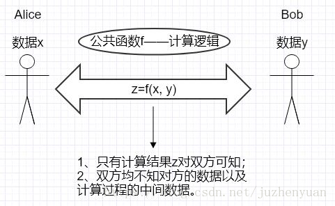

# 简介
安全多方计算（Secure Multi-Party Computation，SMC）的研究主要是针对无可信第三方的情况下，如何安全地计算一个约定函数的问题。
SMC是解决一组互不信任的参与方之间保护隐私的协同计算问题，SMC要确保输入的独立性、计算的正确性、去中心化等特征，同时不泄露各输入值给参与计算的其他成员。主要是针对无可信第三方的情况下，如何安全地计算一个约定函数的问题，同时要求每个参与主体除了计算结果外不能得到其他实体任何的输入信息

安全多方计算是电子选举、门限签名以及电子拍卖等诸多应用得以实施的密码学基础。

一个安全多方计算协议，如果对于拥有无限计算能力攻击者而言是安全的，则称作是`信息论安全的或无条件安全`的；如果对于拥有多项式计算能力的攻击者是安全的，则称为是`密码学安全的或条件安全的`。
已有的结果证明了在无条件安全模型下，当且仅当恶意参与者的人数少于总人数的1/3时，安全的方案才存在。而在条件安全模型下，当且仅当恶意参与者的人数少于总人数的一半时，安全的方案才存在。

安全多方计算起源于1982年姚期智的百万富翁问题。该问题表述为：两个百万富翁Alice和Bob想知道他们两个谁更富有，但他们都不想让对方知道自己财富的任何信息。在双方都不提供真实财富信息的情况下，如果比较两个人的财富多少，并给出可信证明。

## 场景
（1）Alice认为她的了某种遗传疾病，想验证自己的想法。正好她知道Bob有一个关于疾病的DNA模型的数据库。如果她把自己的DNA样品寄给Bob，那么Bob可以给出她的DNA的诊断结果。但是Alice又不想别人知道，这是她的隐私。所以，她请求Bob帮忙诊断自己DNA的方式是不可行的。因为这样Bob就知道了她的DNA及相关私人信息。

（2）两个金融组织计划为了共同的利益决定互相合作一个项目。每个组织都想自己的需求获得满足。然而，他们的需求都是他们自己专有的数据，没人愿意透露给其他方，甚至是“信任”的第三方。那么他们如何在保护数据私密性的前提下合作项目呢？

以上例子都有一个共同的特点：
- 两方或者多方参与基于他们各自隐私或秘密数据输入的计算。	
- 参与一方都不愿意让其他任何第三方知道自己的输入信息。

安全多方计算可以抽象的理解为：两方分别拥有各自的私有数据，在不泄漏各自私有数据的情况下，能够计算出关于公共函数 的结果。整个计算完成时，只有计算结果对双方可知，且双方均不知对方的数据以及计算过程的中间数据。

## 
安全两方计算所使用的协议为Garbled Circuit(GC)+Oblivious Transfer(OT)；而安全多方计算所使用的协议为同态加密+秘密分享+OT（+承诺方案+零知识证明等

### 茫然传输协议(OT协议)
A向B发送消息，B有可能收到A的消息，也可能没收到B的消息。而发送者A对于发送消息的两种可能性是不知道的，也就是说是茫然的。

### 安全挑战模型
包括半诚实敌手模型和恶意敌手模型。市场大部分场景满足半诚实敌手模型:
- 半诚实敌手模型：半诚实关系即参与方之间有一定的信任关系，适合机构之间的数据计算；一个半诚实成员完全遵守协议的执行过程，中途不退出协议的执行过程，也不篡改协议运行结果，但其可以保留执行协议过程中的一些中间结果，并通过这些中间结果试图分析推导其他成员的输入数据。

- 恶意敌手模型：参与方根本就不按照计算协议执行计算过程，能够随意中断协议的运行，破坏协议的正常执行过程，也能随意修改协议的中间结果或者与其他参与方相互勾结。参与方可采用任何（恶意）方式与对方通信，且没有任何信任关系。结果可能是协议执行不成功，双方得不到任何数据；或者协议执行成功，双方仅知道计算结果。更多适用于个人之间、或者个人与机构之间的数据计算

### 例子：计算平均工资
假设有五个员工，A，B，C，D，E，他们的工资分别为小写的a,b,c,d,e，他们都有自己的公钥，私钥PK，SK

A先选择一个大的随机整数，然后将自己的工资与其相加，然后用B的公钥加密，发给B。
B获取密文后，用自己的私钥解密后，将自己的工资与该明文数字相加，然后用C的公钥加密，发给C
C ->D...
D->E...
E获取密文后，用自己的私钥解密后，将自己的工资与该明文数字相加，然后用A的公钥加密，发给A
A拿到密文后，用自己的私钥解密后，将之前的大的随机数减去，除以5即得平均工资，发给其他人。
