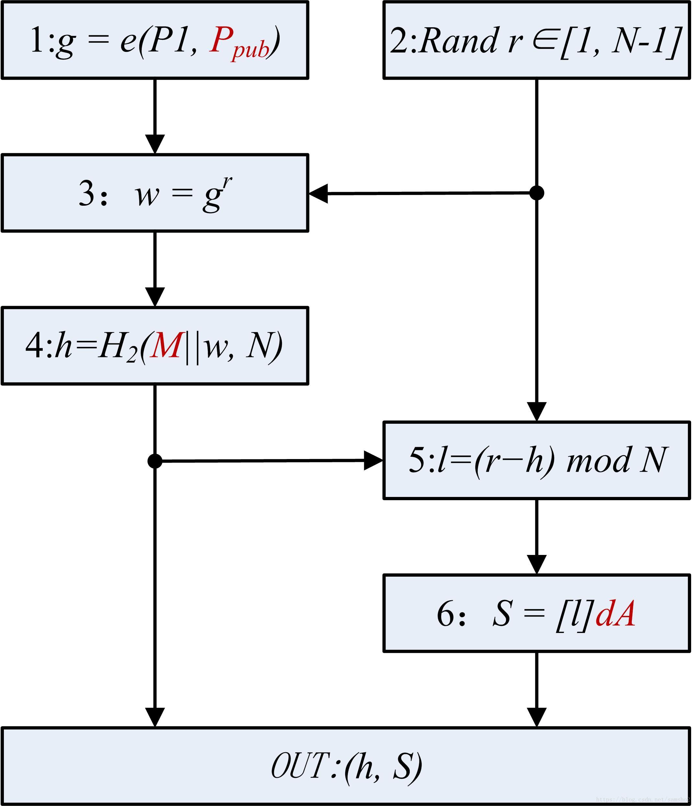
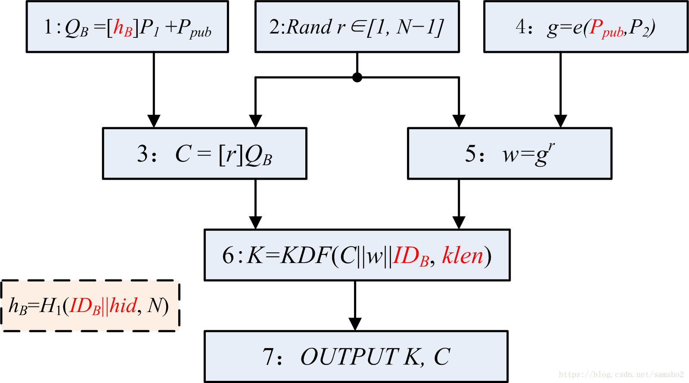
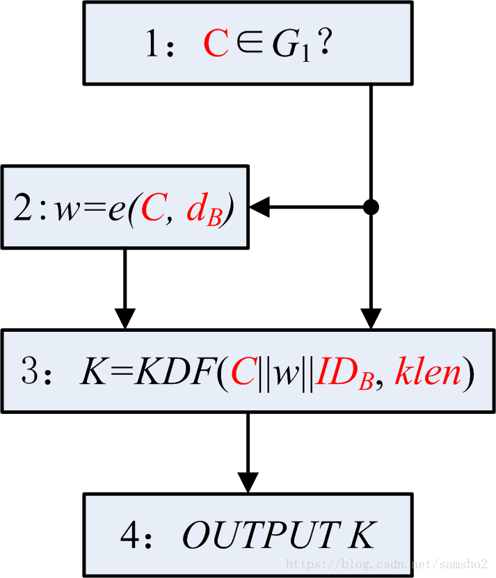
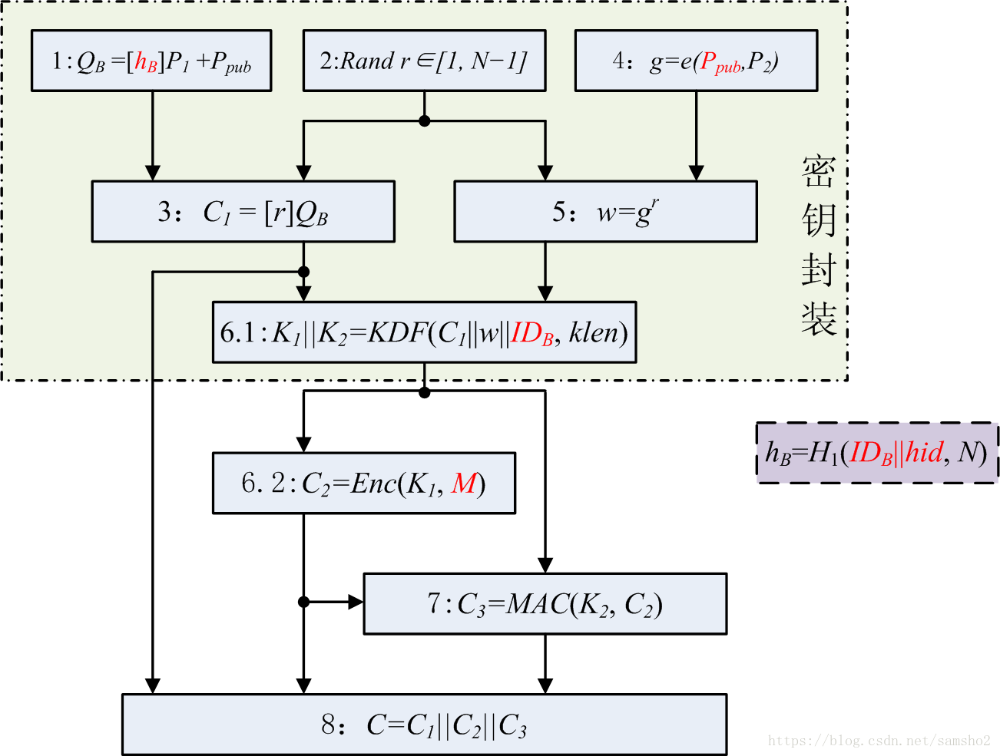
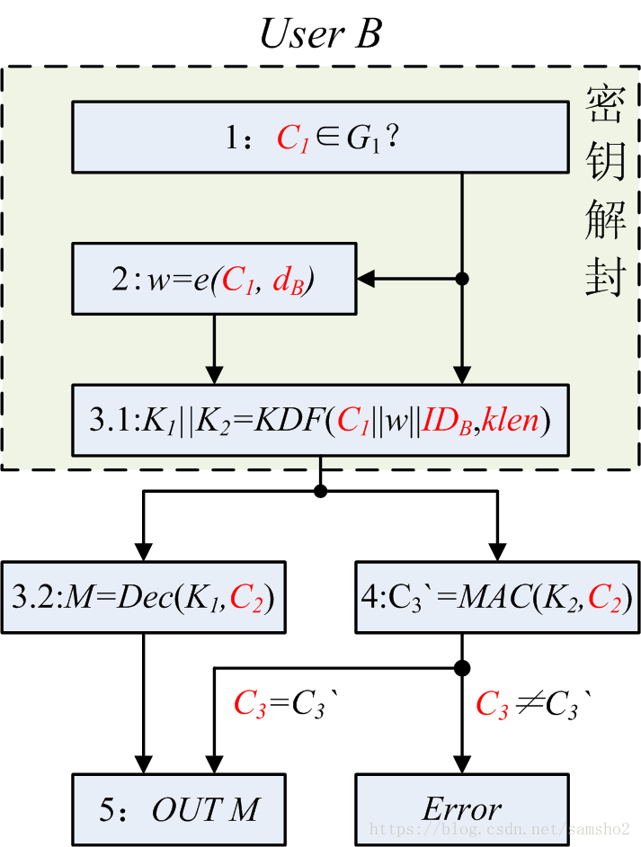

# MAC

# HMAC

# RSA

## 例子

## 公钥

#Diffie-Hellman密钥交换算法
DH算法的安全性依赖于离散对数问题的计算难度。

## 中间人攻击

预防：
- 使用共享对称密钥对DH密钥交换过程加密。
- 使用公钥对DH密钥交换过程加密。
- 使用私钥对DH密钥交换过程中的值签名

# ECC
## 椭圆曲线

## 加法（椭圆曲线唯一需要的数学运算）
P1+P2 = P3
几何上解释：做一条直线通过P1和P2，直线与椭圆曲线在另一处相交，交点围绕x轴做对称映射，得到P3.
## 离散

例子：

## 椭圆曲线上的模P加法

# 秘密共享

## 密钥托管

# 国密算法
# SM4
SM4是分组算法，分组长度128bit，密钥长度128bit（16字节）。加密算法与密钥扩展算法都采用32轮非线性迭代结构。数据解密和加密的算法结构相同，只是轮密钥使用顺序相反，解密轮密钥是加密轮密钥的逆序。

# SM3
对长度l比特的消息（l<2^64），SM3杂凑算法经过填充、迭代压缩和输出选裁，生成256比特的杂凑值。
## 填充
填充后的数据是512bit的倍数，l+1+k = 448(mod 512)，再填加64比特的l的二进制表示

# SM2

涉及到3类辅助函数：密码杂凑函数、密钥派生函数、随机数发生器。这3类辅助函数的强弱直接影响算法的安全性。

## 椭圆曲线系统参数

SM2的参数

## 密钥对

私钥32字节，公钥32+32字节

## 用户其他信息

## 数字签名

签名：

Hv()选用SM3摘要算法，输出是256bit的杂凑值，记为H256()。

验证：

IDA：
16字节*8 = 128bit = 0x0080

## 加解密
### 加密

C1的长度是1+32+32字节(C1 = 04||x1||y1)，C3的长度是SM3摘要的长度，256bit，C2的长度是klen 比特。

其中KDF

### 解密

## 密钥交换协议

# SM9
标识密码（Identity-Based Cryptography），用户的私钥由密钥生成中心KGC根据主密钥和用户标识计算得出，用户的公钥由用户标识唯一确定，用户不需要通过第三方来保证其公钥的真实性。
- 主密钥：主私钥由KGC秘密保存，主公钥公开。KGC用主私钥和用户标识生成用户的私钥
- 签名系统的主密钥与加密系统的主密钥不同。

SM9标识密码算法是一种基于双线性对的标识密码算法,它可以把用户的身份标识用以生成用户的公、私密钥对,主要用于数字签名、数据加密、密钥交换以及身份认证等.SM9密码算法的密钥长度为256b.SM9密码算法的应用与管理不需要数字证书、证书库或密钥库

## 密钥
SM9算法的密钥由KGC(密钥生成中心)产生，主要包括KGC的主密钥对和用户的私钥。 

主密钥对分为签名主密钥对和加密主密钥对。签名主密钥对：其私钥是一个在[1,N-1]范围内的随机数；公钥是G2群的基点P2的倍点，倍数为私钥。加密主密钥对：其私钥是一个在[1,N-1]范围内的随机数；公钥是G1群的基点P1的倍点，倍数为私钥。

主密钥对的公私钥用在不同场景，其中主私钥仅用于计算用户私钥；主公钥则由KGC公开并用在其他部分。同时，签名主公钥仅用于签名和验签算法；加密主公钥则用于密钥封装、加密和密钥交换中。

用户私钥由KGC产生，包括签名私钥和加密私钥。
- 签名私钥：是G1群的基点P1的倍点。签名私钥仅用于签名中
- 加密私钥：是G2群的基点P2的倍点。加密私钥用于密钥解封、解密和密钥交换中私钥
- KGC使用主私钥和用户身份标识(以下简称ID)生成用户的私钥。

## 算法
- 签名算法：使用`签名主公钥`和签名者的`签名私钥`给数据签名

- 验签算法：使用签名主公钥和`签名者ID`验证签名

证明：

- 密钥封装算法：使用加密主公钥和密钥解封者(使用对称密钥的另一方)ID封装一个对称密钥

- 密钥解封算法：使用密钥解封者私钥和ID解出封装了的对称密钥

证明：

- 加密算法：使用加密主公钥和解密者ID加密数据

- 解密算法：使用解密者的`加密私钥`和解密者ID解密数据
v

- 密钥交换算法：密钥交换双方使用加密主公钥、自己的加密私钥和双方的ID协商出一个共享密钥

证明：

