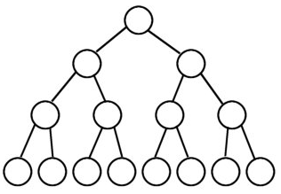

# 树
## 二叉树（每个节点最多有2个子树的有序树）

二叉查找树是一种动态查找表，具有这些性质：                                 
（1）若它的左子树不为空，则左子树上的所有节点的值都小于它的根节点的值；

（2）若它的右子树不为空，则右子树上所有节点的值都大于它的根节点的值；

（3）其他的左右子树也分别为二叉查找树；

（4）二叉查找树是动态查找表，在查找的过程中可见添加和删除相应的元素，在这些操作中需要保持二叉查找树的以上性质。


### 完美二叉树/满二叉树(Perfect Binary Tree)


A Perfect Binary Tree(PBT) is a tree with all leaf nodes at the same depth. 
All internal nodes have degree 2.

### 完全二叉树(Complete Binary Tree)
完全二叉树从根结点到倒数第二层满足完美二叉树，最后一层可以不完全填充，其叶子结点都靠左对齐。


- 完美(Perfect)二叉树一定是完全(Complete)二叉树，但完全(Complete)二叉树不一定是完美(Perfect)二叉树。
- 完美(Perfect)二叉树一定是完满(Full)二叉树，但完满(Full)二叉树不一定是完美(Perfect)二叉树。
- 完全(Complete)二叉树可能是完满(Full)二叉树，完满(Full)二叉树也可能是完全(Complete)二叉树。
- 既是完全(Complete)二叉树又是完满(Full)二叉树也不一定就是完美(Perfect)二叉树。


### 平衡二叉树（AVL树）
含有相同节点的二叉查找树可以有不同的形态，而二叉查找树的平均查找长度与树的深度有关，所以需要找出一个查找平均长度最小的一棵，那就是平衡二叉树，具有以下性质：
（1）要么是棵空树，要么其根节点左右子树的深度之差的绝对值不超过1；

（2）其左右子树也都是平衡二叉树；

（3）二叉树节点的平衡因子定义为该节点的左子树的深度减去右子树的深度。则平衡二叉树的所有节点的平衡因子只可能是-1,0,1。


### 红黑树
红黑树是一种自平衡二叉树，在平衡二叉树的基础上每个节点又增加了一个颜色的属性，节点的颜色只能是红色或黑色。具有以下性质：

（1）根节点只能是黑色；

（2）红黑树中所有的叶子节点后面再接上左右两个空节点，这样可以保持算法的一致性，而且所有的空节点都是黑色；

（3）其他的节点要么是红色，要么是黑色，红色节点的父节点和左右孩子节点都是黑色，及`黑红相间`；

（4）在任何一棵子树中，从根节点向下走到空节点的路径上所经过的黑节点的数目相同，从而保证了是一个平衡二叉树。


### 线索二叉树
n结点的二叉链表共有2n个链域，非空链域为n-1个，但其中的空链域却有n+1个。如下图所示
因此，提出了一种方法，利用原来的空链域存放指针，指向树中其他结点。这种指针称为线索。

线索链表解决了无法直接找到该结点在某种遍历序列中的前驱和后继结点的问题，解决了二叉链表找左、右孩子困难的问题。

### 哈夫曼树(Huffman Tree)
在一棵树中，从一个结点往下可以达到的孩子或孙子结点之间的通路，称为路径。通路中分支的数目称为路径长度。若规定根结点的层数为1，则从根结点到第L层结点的路径长度为L-1。

若将树中结点赋给一个有着某种含义的数值，则这个数值称为该结点的权。结点的带权路径长度为：从根结点到该结点之间的路径长度与该结点的权的乘积。

树的带权路径长度规定为所有`叶子结点`的带权路径长度之和，记为WPL。
WPL = 6 * 2 + 3 * 2 + 8 * 2 = 34；
若带权路径长度达到最小，称这样的二叉树为最优二叉树，也称为霍夫曼树(Huffman Tree)


叶子结点为A、B、C、D，对应权值分别为7、5、2、4。
3.1.a树的WPL = 7 * 2 + 5 * 2 + 2 * 2 + 4 * 2 = 36
3.1.b树的WPL = 7 * 1 + 5 * 2 + 2 * 3 + 4 * 3 = 35
由ABCD构成叶子结点的二叉树形态有许多种，但是WPL最小的树只有3.1.b所示的形态。则3.1.b树为一棵霍夫曼树。

#### 构造霍夫曼树
我们准备一组数以 1，7，3，4，9，8为例子，对这一组数字进行排序。规则是从小到大排列。排列之后的顺序是 1，3，4，7，8，9。
1. 在这些数中 选择两个最小的数字（哈夫曼树是从下往上排列的）写在纸上
2. 用一个类似于树杈的“树枝”连接上两个最小的数。在顶点处计算出这两个数字的和 并写在上面。然后再比较剩下的数字和这个和的大小，再取出两个最小的数字进行排列
3. 如果两个数的和正好是下一步的两个最小数的其中的一个那么这个树直接往上生长就可以了。如果这两个数的和比较大不是下一步的两个最小数的其中一个那么，就并列生长


### 链式存储结构
链表中每个结点由三个域组成，数据域和左右指针域，左右指针分别用来给出该结点左孩子和右孩子所在的链结点的存储地址


为了方便访问某结点的双亲，还可以给链表结点增加一个双亲字段parent,用来指向其双亲结点。每个结点由四个域组成


### 遍历
有深度遍历和广度遍历。
1. 深度遍历分为三种（按照根节点的位置）：前序、中序、后序。


前序顺序是ABC（根节点排最先，然后同级先左后右）；中序顺序是BAC(先左后根最后右）；后序顺序是BCA（先左后右最后根）。


```java
//前序：根结点 ---> 左子树 ---> 右子树
public void preOrderTraverse1(TreeNode root) {
    if (root != null) {
        System.out.print(root.val+"  ");
        preOrderTraverse1(root.left);
        preOrderTraverse1(root.right);
    }
}
//中序：左子树 ---> 根结点 ---> 右子树
public void inOrderTraverse1(TreeNode root) {
    if (root != null) {
        inOrderTraverse1(root.left);
        System.out.print(root.val+"  ");
        inOrderTraverse1(root.right);
    }
}

```

2. 广度遍历即层次遍历。
从根节点出发，在横向遍历二叉树层段节点的基础上纵向遍历二叉树的层次

```java
//Definition for a binary tree node.
public class TreeNode {
  int val;
  TreeNode left;
  TreeNode right;
  TreeNode(int x) { val = x; }
}

//使用Queue实现BFS
public void BFSWithQueue(TreeNode root) {
    Queue<TreeNode> queue = new LinkedList<>();
    if (root != null)
        queue.add(root);
    while (!queue.isEmpty()) {
        TreeNode treeNode = queue.poll();
 
        //在这里处理遍历到的TreeNode节点 
        if (treeNode.left != null)
            queue.add(treeNode.left);
        if (treeNode.right != null)
            queue.add(treeNode.right);
    }
}

```

## B-树
B-树是一种平衡`多路`查找树，它在文件系统中很有用。一棵m阶B-树（图d为4阶B-树），具有下列性质：
（1）树中每个节点至多有m棵子树；
（2）若根节点不是叶子节点，则至少有2棵子树；
（3）除根节点之外的所有非终端节点至少有m/2棵子树；
（4）每个节点中的信息结构为（A0,K1,A1,K2......Kn,An），其中n表示关键字个数，Ki为关键字，Ai为指针；
（5）所有的叶子节点都出现在同一层次上，且不带任何信息，也是为了保持算法的一致性。


## B+树
B+数是B-树的一种变形，它与B-树的差别在于（图e为3阶B+树）：
（1）有n棵子树的节点含有n个关键字；
（2）所有的叶子节点包含了全部关键字的信息，及指向这些关键字记录的指针，且叶子节点本身按关键字大小自小到大顺序链接；
（3）所有非终端节点可以看成是索引部分，节点中仅含有其子树（根节点）中最大（或最小）关键字，所有B+树更像一个索引顺序表；
（4）对B+树进行查找运算，一是从最小关键字起进行顺序查找，二是从根节点开始，进行随机查找。


## 字典树（trie树）
字典树是一种以树形结构保存大量字符串。以便于字符串的统计和查找，经常被搜索引擎系统用于文本词频统计。它的优点是：利用字符串的公共前缀来节约存储空间，最大限度地减少无谓的字符串比较，查询效率比哈希表高。具有以下特点（图f）：
（1）根节点为空；
（2）除根节点外，每个节点包含一个字符；
（3）从根节点到某一节点，路径上经过的字符连接起来，为该节点对应的字符串。
（4）每个字符串在建立字典树的过程中都要加上一个区分的结束符，避免某个短字符串正好是某个长字符串的前缀而淹没。


