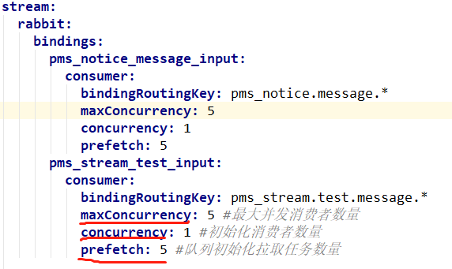

# 消息队列(Message Queue)

JDK自带的队列都存储在内存中，一但应用或者服务器挂了，消息就丢失了，使用消息队列可以避免消息丢失问题（注意不是100%不丢失）

# RabbitMQ
RabbitMQ是用Erlang语言开发的基于高级消息队列协议(AMQP)的消息队列中间件。

- 生产者：发送消息的应用程序被称为生产者。
- 消费者：接收消息的应用程序被称为消费者。

## 默认配置
- 默认的端口号：5672
- 默认的用户是guest guest
- 管理后台的默认端口号：15672 . 浏览器输入http://localhost:15672/，RabbitMQ的管理后台，然后使用默认的guest账号登录，在这个后台，可以完成新建用户，配置用户角色，新建队列等操作，

## 支持的协议
- RabbitMQ was originally developed to support AMQP 0-9-1. As such this protocol is the "core" protocol supported by the broker. AMQP 0-9-1 is a binary protocol, and defines quite strong messaging semantics.
- STOMP is a text-based messaging protocol emphasising (protocol) simplicity
- MQTT is a binary protocol emphasising lightweight publish / subscribe messaging, targetted towards clients in constrained devices。RabbitMQ supports MQTT 3.1 via a plugin.
- AMQP 1.0 is a radically different protocol from AMQP 0-9-1 。RabbitMQ supports AMQP 1.0 via a plugin.


## RabbitMQ
rabbitmq中的几个重要概念
1. 虚拟主机(vhost)

​ 虚拟主机：一个虚拟主机持有一组交换机、队列和绑定。虚拟主机的作用在于进行权限管控，rabbitmq默认有一个虚拟主机"/"。可以使用rabbitmqctl add_vhost命令添加虚拟主机，然后使用rabbitmqctl set_permissions命令设置指定用户在指定虚拟主机下的权限，以此达到权限管控的目的。

2. 消息通道(channel)
在客户端的每个连接里，可建立多个channel，每个channel代表一个会话任务

3. 交换机(exchange)
exchange的功能是用于消息分发，它负责接收消息并转发到与之绑定的队列，exchange不存储消息，如果一个exchange没有binding任何Queue，那么当它会丢弃生产者发送过来的消息，在启用ACK机制后，如果exchange找不到队列，则会返回错误。一个exchange可以和多个Queue进行绑定。

交换机有四种类型:
- 路由模式(Direct)："先匹配, 再投送"。即在绑定时设定一个 routing_key, 消息的routing_key 匹配时, 才会被交换器投送到绑定的队列中去。direct是rabbitmq的默认交换机类型。

- 通配符模式(Topic)：​类似路由模式，但是routing_key支持模糊匹配，按规则转发消息（最灵活）。符号“#”匹配一个或多个词，符号“*”匹配不多不少一个词。

- 发布订阅模式(Fanout)：​转发消息到所有绑定队列，忽略routing_key。

- Headers:  设置header attribute参数类型的交换机。相较于 direct 和 topic 固定地使用 routing_key , headers 则是一个自定义匹配规则的类型，忽略routing_key。在队列与交换器绑定时, 会设定一组键值对规则, 消息中也包括一组键值对( headers 属性), 当这些键值对有一对, 或全部匹配时, 消息被投送到对应队列。
​ 在绑定Queue与Exchange时指定一组键值对，当消息发送到RabbitMQ时会取到该消息的headers与Exchange绑定时指定的键值对进行匹配。如果完全匹配则消息会路由到该队列，否则不会路由到该队列。headers属性是一个键值对，可以是Hashtable，键值对的值可以是任何类型。

匹配规则x-match有下列两种类型：
|x-match = all  | 表示所有的键值对都匹配才能接受到消息|
|---------------|----------------------------------|
|x-match = any  |表示只要有键值对匹配就能接受到消息    |

## 例子
```xml
<dependency>
   <groupId>com.rabbitmq</groupId>
   <artifactId>amqp-client</artifactId>
   <version>5.7.0</version>
</dependency>
```
生产者
```java
public class Producer {
    private final static String QUEUE_NAME = "hello";

    public static void main(String[] args) throws IOException, TimeoutException {
        // 创建连接
        ConnectionFactory factory = new ConnectionFactory();
        // 设置 RabbitMQ 的主机名
        factory.setHost("localhost");
        // 创建一个连接
        Connection connection = factory.newConnection();
        // 创建一个通道
        Channel channel = connection.createChannel();
        // 指定一个队列,不存在的话自动创建
        channel.queueDeclare(QUEUE_NAME, false, false, false, null);
        // 发送消息
        String message = "Hello World!";
        channel.basicPublish("", QUEUE_NAME, null, message.getBytes());
        System.out.println(" [x] Sent '" + message + "'");
        // 关闭频道和连接
        channel.close();
        connection.close();
    }
}
```
运行代码，在RabbitMQ管理后台，会看到队列新建成功，并且有1个消息待消费


消费者
```java
public class Consumer {
    private final static String QUEUE_NAME = "hello";

    public static void main(String[] args) throws IOException, TimeoutException {
        // 创建连接
        ConnectionFactory factory = new ConnectionFactory();
        // 设置 RabbitMQ 的主机名
        factory.setHost("localhost");
        // 创建一个连接
        Connection connection = factory.newConnection();
        // 创建一个通道
        Channel channel = connection.createChannel();
        // 指定一个队列
        channel.queueDeclare(QUEUE_NAME, false, false, false, null);
        // 创建队列消费者
        com.rabbitmq.client.Consumer consumer = new DefaultConsumer(channel) {
            @Override
            public void handleDelivery(String consumerTag, Envelope envelope,
                                       AMQP.BasicProperties properties, byte[] body) throws IOException {
                String message = new String(body, "UTF-8");
                System.out.println("Received Message '" + message + "'");
            }
        };
        channel.basicConsume(QUEUE_NAME, true, consumer);
    }
}
```
此时再看下RabbitMQ管理后台，会发现队列'hello'待消费的消息为0


## 在使用RabbitMQ时，如何保证消息最大程度的不丢失并且被正确消费？
RabbitMQ针对这个问题，提供了以下几个机制来解决：
1. 生产者确认
2. 持久化
3. 手动Ack

### 生产者确认
要想保证消息不丢失，首先我们得保证生产者能成功的将消息发送到RabbitMQ服务器。
1. 通过事务机制实现
```java
channel.txSelect(); //用于将当前的信道设置成事务模式
int loopTimes = 10;

for (int i = 0; i < loopTimes; i++) {
    try {
        // 发送消息
        String message = "Hello World!" + i;
        channel.basicPublish("", QUEUE_NAME, null, message.getBytes());

        channel.txCommit(); //用于提交事务
        System.out.println(" [x] Sent '" + message + "'");
    } catch (IOException e) {
        e.printStackTrace();
        channel.txRollback(); //用于回滚事务
    }
}
 ```
 使用事务机制会“吸干”RabbitMQ的性能，因此建议使用下面讲到的发送方确认机制。

2. 通过发送方确认（publisher confirm）机制实现

生产者将信道设置成confirm（确认）模式，一旦信道进入confirm模式，所有在该信道上面发布的消息都会被指派一个唯一的ID（从1开始），一旦消息被投递到RabbitMQ服务器之后，RabbitMQ就会发送一个确认（Basic.Ack）给生产者（包含消息的唯一ID），这就使得生产者知晓消息已经正确到达了目的地了。
如果RabbitMQ因为自身内部错误导致消息丢失，就会发送一条nack（Basic.Nack）命令，生产者应用程序同样可以在回调方法中处理该nack指令。
如果消息和队列是可持久化的，那么确认消息会在消息写入磁盘之后发出。
事务机制在一条消息发送之后会使发送端阻塞，以等待RabbitMQ的回应，之后才能继续发送下一条消息。

相比之下，发送方确认机制最大的好处在于它是异步的，一旦发布一条消息。生产者应用程序就可以在等信道返回确认的同时继续发送下一条消息，当消息最终得到确认后，生产者应用程序便可以通过回调方法来处理该确认消息。

- 普通confirm
```java
channel.confirmSelect(); //将信道设置成confirm模式
int loopTimes = 10;

for (int i = 0; i < loopTimes; i++) {
    try {
        // 发送消息
        String message = "normal confirm test" + i;
        channel.basicPublish(EXCHANGE_NAME, "", null, message.getBytes());
        //等待发送消息的确认消息，如果发送成功，则返回ture，如果发送失败，则返回false
        if (channel.waitForConfirms()) {
            System.out.println("send message success");
        } else {
            System.out.println("send message failed");
            // do something else...
        }
    } catch (InterruptedException e) {
        e.printStackTrace();
    }
}
```
- 批量confirm
每发送一批消息后，调用channel.waitForConfirms()方法，等待服务器的确认返回，因此相比于5.1中的普通confirm模式，性能更好。
但是不好的地方在于，如果出现返回Basic.Nack或者超时情况，生产者客户端需要将这一批次的消息全部重发，这样会带来明显的重复消息数量，如果消息经常丢失，批量confirm模式的性能应该是不升反降的。
```java
int batchCount = 100;
int msgCount = 0;
BlockingQueue blockingQueue = new ArrayBlockingQueue(100);
try {
    channel.confirmSelect();
    while (msgCount <= batchCount) {
        String message = "batch confirm test";
        channel.basicPublish(EXCHANGE_NAME, "", null, message.getBytes());
        // 将发送出去的消息存入缓存中，缓存可以是一个ArrayList或者BlockingQueue之类的
        blockingQueue.add(message);
        if (++msgCount >= batchCount) {
            try {
                if (channel.waitForConfirms()) {
                    // 将缓存中的消息清空
                    blockingQueue.clear();
                } else {
                    // 将缓存中的消息重新发送
                }
            } catch (InterruptedException e) {
                e.printStackTrace();
                // 将缓存中的消息重新发送
            }
        }
    }
} catch (IOException e) {
    e.printStackTrace();
}

```


- 异步confirm
异步confirm模式是在生产者客户端添加ConfirmListener回调接口，重写接口的handAck()和handNack()方法，分别用来处理RabblitMQ回传的Basic.Ack和Basic.Nack。
这两个方法都有两个参数，第1个参数deliveryTag用来标记消息的唯一序列号，第2个参数multiple表示的是是否为多条确认,值为true代表是多个确认，值为false代表是单个确认。

```java
int batchCount = 100;
long msgCount = 1;
SortedSet<Long> confirmSet = new TreeSet<Long>();
channel.confirmSelect();
channel.addConfirmListener(new ConfirmListener() {
    @Override
    public void handleAck(long deliveryTag, boolean multiple) throws IOException {
        System.out.println("Ack,SeqNo：" + deliveryTag + ",multiple：" + multiple);
        if (multiple) {
            confirmSet.headSet(deliveryTag - 1).clear();
        } else {
            confirmSet.remove(deliveryTag);
        }
    }

    @Override
    public void handleNack(long deliveryTag, boolean multiple) throws IOException {
        System.out.println("Nack,SeqNo：" + deliveryTag + ",multiple：" + multiple);
        if (multiple) {
            confirmSet.headSet(deliveryTag - 1).clear();
        } else {
            confirmSet.remove(deliveryTag);
        }
        // 注意这里需要添加处理消息重发的场景
    }
});
// 演示发送100个消息
while (msgCount <= batchCount) {
    long nextSeqNo = channel.getNextPublishSeqNo();
    channel.basicPublish(EXCHANGE_NAME, "", null, "async confirm test".getBytes());
    confirmSet.add(nextSeqNo);
    msgCount = nextSeqNo;
}

```

### 持久化
就是RabbitMQ会将内存中的数据(Exchange 交换器，Queue 队列，Message 消息)固化到磁盘，以防异常情况发生时，数据丢失。
- Exchange 交换器
```java
//设置Exchange持久化：durable设置为true表示持久化，反之是非持久化
channel.exchangeDeclare(EXCHANGE_NAME, "direct", true);
```
- Queue 队列
```java
//将durable参数设置为true：
channel.queueDeclare(QUEUE_NAME, true, false, false, null);
```
- Message 消息
```java
// 设置消息的投递模式为2，即代表持久化。
String message = "durable exchange test";
AMQP.BasicProperties props = new AMQP.BasicProperties().builder().deliveryMode(2).build();
channel.basicPublish(EXCHANGE_NAME, "", props, message.getBytes());
```
持久化的例子：
```java
public class DurableProducer {
    private final static String EXCHANGE_NAME = "durable-exchange";
    private final static String QUEUE_NAME = "durable-queue";

    public static void main(String[] args) throws IOException, TimeoutException {
        // 创建连接
        ConnectionFactory factory = new ConnectionFactory();
        // 设置 RabbitMQ 的主机名
        factory.setHost("localhost");
        // 创建一个连接
        Connection connection = factory.newConnection();
        // 创建一个通道
        Channel channel = connection.createChannel();
        // 创建一个Exchange
        channel.exchangeDeclare(EXCHANGE_NAME, "direct", true);
        channel.queueDeclare(QUEUE_NAME, true, false, false, null);
        channel.queueBind(QUEUE_NAME, EXCHANGE_NAME, "");

        // 发送消息
        String message = "durable exchange test";
        AMQP.BasicProperties props = new AMQP.BasicProperties().builder().deliveryMode(2).build();
        channel.basicPublish(EXCHANGE_NAME, "", props, message.getBytes());

        // 关闭频道和连接
        channel.close();
        connection.close();
    }
}
```

### 注意事项
- 理论上可以将所有的消息都设置为持久化，但是这样会严重影响RabbitMQ的性能。因为写入磁盘的速度比写入内存的速度慢得不止一点点。对于可靠性不是那么高的消息可以不采用持久化处理以提高整体的吞吐量。在选择是否要将消息持久化时，需要在可靠性和吞吐量之间做一个权衡。
- 将交换器、队列、消息都设置了持久化之后仍然不能百分之百保证数据不丢失，因为当持久化的消息正确存入RabbitMQ之后，还需要一段时间（虽然很短，但是不可忽视）才能存入磁盘之中。如果在这段时间内RabbitMQ服务节点发生了宕机、重启等异常情况，消息还没来得及落盘，那么这些消息将会丢失。
- 单单只设置队列持久化，重启之后消息会丢失；单单只设置消息的持久化，重启之后队列消失，继而消息也丢失。单单设置消息持久化而不设置队列的持久化显得毫无意义。

## Spring Cloud Stream 工作原理


- RabbitMQ

引入包
```xml
 <dependency>
    <groupId>org.springframework.cloud</groupId>
    <artifactId>spring-cloud-starter-stream-rabbit</artifactId>
</dependency>
```
1. 消息的发送者

配置
```yml
spring:
  cloud:
    stream:
      binders: # 这是一组binder的集合，这里配置了一个名为defaultRabbit的binder，这个binder中是包含了一个rabbit的连接信息
        defaultRabbit: # 表示定义的名称，用于于binding整合
          type: rabbit # 消息组件类型
          environment: # 设置rabbitmq的相关的环境配置
            spring:
              rabbitmq:
              addresses: 10.0.20.132
              username: studyjava
              password: hello
              virtual-host: /
      bindings: # 这里配置了一个名为output的binding，这个binding中配置了指向defaultRabbit的binder下的一个交换机studyExchange
        output: # 这个名字是一个通道的名称
          destination: studyExchange # 表示要使用的Exchange名称定义
          content-type: application/json # 设置消息类型，本次为对象json，如果是文本则设置“text/plain”
          binder: defaultRabbit # 设置要绑定的消息服务的具体设置
```
定义消息发送接口
```java
public interface IMessageProvider {

    /**
    * 实现消息的发送，本次发送的消息是一个对象（自动变为json）
    * @param company VO对象，该对象不为null*/
      public void send(Company company) ;
}

@EnableBinding(Source.class) // 可以理解为是一个消息的发送管道的定义
public class MessageProviderImpl implements IMessageProvider {
    @Resource
    private MessageChannel output; // 消息的发送管道

    @Override
    public void send(Company company) {
        this.output.send(MessageBuilder.withPayload(company).build()); // 创建并发送消息
    }
}

public interface Source {
    String OUTPUT = "output"; // 之前所设置的消息发送的管道

    @Output(Source.OUTPUT)
    MessageChannel output();
}
```
测试用例：
```java
public class TestMessageProvider {
    @Resource
    private IMessageProvider messageProvider;

    @Test
    public void testSend() {
        Company company = new Company();
        company.setTitle("studyjava");
        company.setNote("更多资源请登录：www.study.cn");
        this.messageProvider.send(company); // 消息发送
    }
}
```

启动 RabbitMQ 以及相应的微服务进行消息的发送处理，如果可以检测到 RabbitMQ 上的活动信息就表示该微服务创建成功

2. 消息的接收者

```yml
spring:
  cloud:
    stream:
      binders: # 在此处配置要绑定的rabbitmq的服务信息；
        defaultRabbit: # 表示定义的名称，用于于binding整合
          type: rabbit # 消息组件类型
          environment: # 设置rabbitmq的相关的环境配置
            spring:
              rabbitmq:
              addresses: 10.0.20.132
              username: studyjava
              password: hello
              virtual-host: /
      bindings: # 服务的整合处理
        input: # 这个名字是一个通道的名称，在分析具体源代码的时候会进行说明
          destination: studyExchange # 表示要使用的Exchange名称定义
          content-type: application/json # 设置消息类型，本次为对象json，如果是文本则设置“text/plain”
          binder: defaultRabbit # 设置要绑定的消息服务的具体设置
```

消息监听
```java
@Component
@EnableBinding(Sink.class)
public class MessageListener {
    @StreamListener(Sink.INPUT)
    public void input(Message<Company> message) {
        System.err.println("【*** 消息接收 ***】" + message.getPayload());
    }
}

public interface Sink {

    String INPUT = "input";

    @Input(Sink.INPUT)
    SubscribableChannel input();

}


```

3. 自定义消息通道
```java
public interface DefaultProcess {
    public static final String OUTPUT = "study_output"; // 输出通道名称
    public static final String INPUT = "study_input"; // 输入通道名称

    @Input(DefaultProcess.INPUT)
    public SubscribableChannel input();

    @Output(DefaultProcess.OUTPUT)
    public MessageChannel output();
}
```
```yml
spring:
  cloud:
    stream:
      binders: # 在此处配置要绑定的rabbitmq的服务信息；
        defaultRabbit: # 表示定义的名称，用于于binding整合
          type: rabbit # 消息组件类型
          environment: # 设置rabbitmq的相关的环境配置
            spring:
              rabbitmq:
              addresses: rabbitmq-server
              username: studyjava
              password: hello
              virtual-host: /
      bindings: # 服务的整合处理
        study_output: # 这个名字是一个通道的名称，在分析具体源代码的时候会进行说明
          destination: studyExchange # 表示要使用的Exchange名称定义
          content-type: application/json # 设置消息类型，本次为对象json，如果是文本则设置“text/plain”
          binder: defaultRabbit # 设置要绑定的消息服务的具体设置
```
```yml
bindings: # 服务的整合处理
    study_input: # 这个名字是一个通道的名称，在分析具体源代码的时候会进行说明
        destination: studyExchange # 表示要使用的Exchange名称定义
        content-type: application/json # 设置消息类型，本次为对象json，如果是文本则设置“text/plain”
        binder: defaultRabbit # 设置要绑定的消息服务的具体设置
```
```java
@EnableBinding(DefaultProcess.class) // 可以理解为是一个消息的发送管道的定义
public class MessageProviderImpl implements IMessageProvider {
    @Resource
    private MessageChannel output; // 消息的发送管道

    @Override
    public void send(Company company) {
        this.output.send(MessageBuilder.withPayload(company).build()); // 创建并发送消息
    }
}

@Component
@EnableBinding(DefaultProcess.class)
public class MessageListener {
    @StreamListener(Sink.INPUT)
    public void input(Message<Company> message) {
        System.err.println("【*** 消息接收 ***】" + message.getPayload());
    }
}

```

- 分组与持久化
所发送的消息在默认情况下它都属于一种临时消息，也就是说如果现在没有消费者进行消费处理，那么该消息是不会被保留的。
 如果要想实现持久化的消息处理，重点在于消息的消费端配置，同时也需要考虑到一个分组的情况（**有分组就表示该消息可以进行持久化**）

```yml
bindings: # 服务的整合处理
    study_input: # 这个名字是一个通道的名称，在分析具体源代码的时候会进行说明
        destination: studyExchange # 表示要使用的Exchange名称定义
        content-type: application/json # 设置消息类型，本次为对象json，如果是文本则设置“text/plain”
        binder: defaultRabbit # 设置要绑定的消息服务的具体设置
        group: study-group # 进行操作的分组，实际上就表示持久化

```
在 SpringCloudStream 之中如果要设置持久化队列，则名称为`destination.group`。此时关闭掉消费端的微服务之后该队列信息依然会被保留在 RabbitMQ 之中。而后在关闭消费端的情况下去运行消息生产者，发送完消息后再运行消息的消费端仍然可以接收到之前的消息。

- 设置 RoutingKey
默认情况下之前的程序都是属于广播消息，也就是说所有的消费者都可以接收发送消息内容，在 RabbitMQ 里面支持有直连消息，而直连消息主要是通过 RoutingKey 来实现，利用直连消息可以实现准确的消息消费端的接收处理。
```yml
spring:
  cloud:
    stream:
      rabbit: # 进行rabbit的相关绑定配置
        bindings:
          study_input:
            consumer: # 进行消费端配置
              bindingRoutingKey: study-key # 设置一个RoutingKey信息
      binders: # 在此处配置要绑定的rabbitmq的服务信息；
        defaultRabbit: # 表示定义的名称，用于于binding整合
          type: rabbit # 消息组件类型
          environment: # 设置rabbitmq的相关的环境配置
            spring:
              rabbitmq:
              addresses: rabbitmq-server
              username: studyjava
              password: hello
              virtual-host: /
      bindings: # 服务的整合处理
        study_input: # 这个名字是一个通道的名称，在分析具体源代码的时候会进行说明
          destination: RKExchange # 表示要使用的Exchange名称定义
          content-type: application/json # 设置消息类型，本次为对象json，如果是文本则设置“text/plain”
          binder: defaultRabbit # 设置要绑定的消息服务的具体设置
          group: study-group # 进行操作的分组，实际上就表示持久化

```

```yml
spring:
  cloud:
    stream:
      rabbit: # 进行rabbit的相关绑定配置
        bindings:
          study_output:
            producer: # 进行消费端配置
              routing-key-expression: '''study-key''' #定义 RoutingKey 的表达式配置
      binders: # 在此处配置要绑定的rabbitmq的服务信息；
```

## spring cloud stream rabbitmq 多消费者动态自增配置
