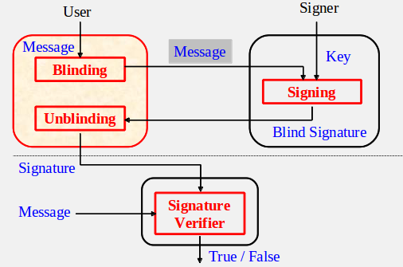

# 盲签名(Blind Signature)

是一种数字签名的方式,在消息内容被签名之前,对于签名者来说消息内容是不可见的.
类比例子:对文件签名就是通过在信封里放一张复写纸，签名者在信封上签名时，他的签名便透过复写纸签到文件上。

> 1.签名者对其所签署的消息是不可见的，即签名者不知道他所签署消息的具体内容。2. 签名消息不可追踪，即当签名消息被公布后，签名者无法知道这是他哪次的签署的。

# 模型
1. 接收者首先将待签数据进行盲变换，把变换后的盲数据发给签名者。
2. 经签名者签名后再发给接收者。
3. 接收者对签名再作去盲变换，得出的便是签名者对原数据的盲签名。
4. 这样便满足了条件①。要满足条件②，必须使签名者事后看到盲签名时不能与盲数据联系起来，这通常是依靠某种协议来实现的。

# RSA方案

