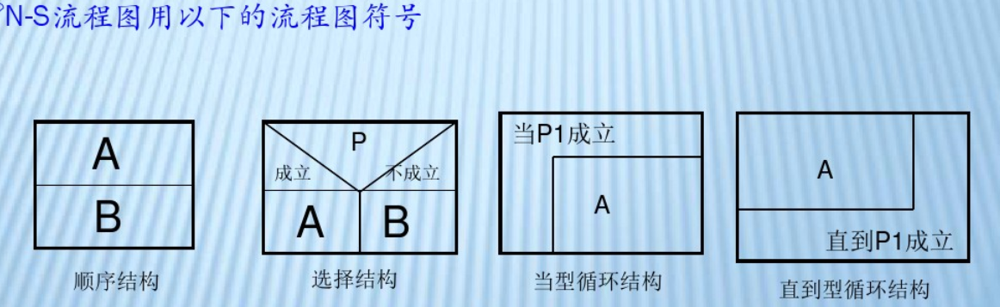

## NS流程图


## 递推算法
递推算法是一种理性思维模式的代表，其根据已有的数据和关系，逐步推导而得到结果。递推算法往往需要用户知道答案和问题之间的逻辑关系。在许多数学问题中，都有着明确的计算公式可以遵循，因此往往可以采用递推来实现。

>我的想法：递**推**是从小往大推，递**归**是从大往小回归。

### 递推算法示例

如果一对两个月大的兔子以后每个月可以生一对兔子，而一对新生的兔子出生两个月后才可以生兔子。也就是说1月份出生的3月份才能生子。假定一年内兔子没有死亡事件，那么一年后共有多少对兔子。

分析产仔问题，逐月分析每月的兔子对数：

第一个月：1对兔子

第二个月：1对兔子

第三个月：2对兔子

第四个月：3对兔子

第五个月：5对兔子

第六个月：8对兔子

可以看出，从第三个月开始，每个月的兔子总队数是前两个月的对数之和，公式如下：

  第n个月兔子总数Fn = F(n-1)+F(n-2)

> 也就是说，上个月的兔子都活到这个月了，另外上上给月的兔子都会在这个月生兔子
```java
public static int Fibonacci(int n){ //月数
    int t1,t2;
    if(n == 1 || n ==2){
        return 1;
    }else{
        t1 = Fibonacci(n-1);
        t2 = Fibonacci(n-2);
        return t1+t2;
    }    
}
```
## 递归算法思想

递归算法即在程序中不断反复调用自身来达到求解问题的方法。
缺点：递归算法比非递归形式运行速度要慢一些。

### 算法示例

计算阶乘，就是从1到指定数之间的所有自然数相乘的结果，n的阶乘为：

n! = n*(n-1)*(n-2)*.......*2*1;
```C
int fact(int n){
   if(n <= 1)
      return n;
   else
      return n*fact(n-1);  //递归
}
```

## 分治算法
字面上的解释是“分而治之”，就是把一个复杂的问题分成两个或更多的相同或相似的子问题，再把子问题分成更小的子问题……直到最后子问题可以简单的直接求解，原问题的解即子问题的解的合并。这个技巧是很多高效算法的基础，如排序算法(快速排序，归并排序)，傅立叶变换(快速傅立叶变换)……

### 分治法使用场景
分治法所能解决的问题一般具有以下几个特征：
1) 该问题的规模缩小到一定的程度就可以容易地解决
2) 该问题可以分解为若干个规模较小的相同问题，即该问题具有最优子结构性质。
3) 利用该问题分解出的`子问题的解可以合并为该问题的解`
4) 该问题所分解出的各个`子问题是相互独立的`，即子问题之间不包含公共的子子问题。

第一条特征是绝大多数问题都可以满足的，因为问题的计算复杂性一般是随着问题规模的增加而增加；
第二条特征是应用分治法的前提,它也是大多数问题可以满足的，此特征反映了递归思想的应用；
第三条特征是关键，能否利用分治法完全取决于问题是否具有第三条特征，如果具备了第一条和第二条特征，而不具备第三条特征，则可以考虑用贪心法或动态规划法。
**第四条特征涉及到分治法的效率**，如果各子问题是不独立的则分治法要做许多不必要的工作，重复地解公共的子问题，此时虽然可用分治法，但一般用动态规划法较好。

使用分治法求解的一些经典问题
 
　　（1）二分搜索
　　（2）大整数乘法
　　（3）Strassen矩阵乘法
　　（4）棋盘覆盖
　　（5）合并排序
　　（6）快速排序
　　（7）线性时间选择
　　（8）最接近点对问题
　　（9）循环赛日程表
　　（10）汉诺塔

### 二分搜索
二分搜索又叫做二分查找、折半查找，它是一种效率较高得查找方法。

二分搜索要求：线性表为有序表，并且要用向量作为表得存储结构。

基本思想：先确定待查找记录所在的范围，然后逐步缩小范围直至找到或找不到该记录位置。

```java
public static void main(String[] args) {
    int[] a = {1,2,3,4,5,6,7,8,9};
    int pos =bSearch(a, 0, a.length-1, 1);
    System.out.println(pos);
}      
      
 public static int bSearch(int[] data,int left,int right,int key){
    //获取中间位置
    int middle = (left+right)/2;
    //比较key值如相等，返回当前位置，否则确认新的查找空间
    if(data[middle] == key){
        return middle;
    }else if(data[middle] >key){
        return bSearch(data, left, middle-1, key);
    }else{
        return bSearch(data, middle+1, right, key);
    }
}
```
### 汉诺塔


将所有的圆盘从塔座A移动到塔座B;塔座C用来临时圆盘,规则如下:

1、一次只能移动一个圆盘
2、任何时候都不能将一个较大的圆盘压在较小的圆盘上面
3、除了第二条限制,任何塔座的最上面的圆盘都可以移动到其他塔座上.

圆盘4最终将从塔座A移动到塔座B.按照游戏规则,在移动圆盘4之前的情况一定如下图


那么问题转换为**如何将前三个圆盘从A移动到C,然后圆盘4从A移动到B,前三个圆盘从C再移动到B.**

> 上面的步骤可以重复!例如将三个圆盘从A移动到C,那么应该先将前两个圆盘从A移动到B,然后将圆盘3从A移动到C,最后将前两个圆盘从B移动到C.持续简化这个问题,最终我们将只需要处理一个圆盘从一个塔座移动到另一个塔座的问题

```java
public class Moved {
    private static int count = 1;
    public static void main(String[] args) {
        moved(4, "第一根柱子", "第二根柱子", "第三根柱子");
    }
    
    /**
     * 
     * @param i  圆盘数量
     * @param a  圆盘初始所在塔座
     * @param b  圆盘将要移动到的塔座
     * @param c  辅助圆盘移动的塔座
     */
    public static void moved(int i,String a,String b,String c){
        if(i == 1){
            disPaly(1, a, b);
        }else{
            //将i-1根圆盘由A移动到C
            moved(i-1, a, c, b);
            //将圆盘i 由A移动到B
            disPaly(i, a, b);
            //将i-1根圆盘由C移动到B
            moved(i-1,c,b,a);
        }
    }
    
    public static void disPaly(int i,String a,String b){
        System.out.println("第"+count+"步：移动第"+i+"个塔从"+a+"到"+b);
        count++;
    }
}
```

## 动态规划算法
动态规划算法通常用于求解具有某种最优性质的问题。在这类问题中，可能会有许多可行解。每一个解都对应于一个值，我们希望找到具有最优值的解。

动态规划算法与分治法类似，其基本思想也是将待求解问题分解成若干个子问题，先求解子问题，然后从这些子问题的解得到原问题的解。与分治法不同的是，**适合于用动态规划求解的问题，经分解得到子问题往往不是互相独立的**。若用分治法来解这类问题，则分解得到的子问题数目太多，有些子问题被重复计算了很多次。如果我们能够保存已解决的子问题的答案，而在需要时再找出已求得的答案，这样就可以避免大量的重复计算，节省时间。我们可以用一个表来记录所有已解的子问题的答案。不管该子问题以后是否被用到，只要它被计算过，就将其结果填入表中。这就是动态规划法的基本思路。具体的动态规划算法多种多样，但它们具有相同的填表格式。

 >动态规划算法与分治法最大的差别是：适合于用动态规划法求解的问题，经分解后得到的子问题往往不是互相独立的（即下一个子阶段的求解是建立在上一个子阶段的解的基础上，进行进一步的求解）

### 应用场景：
适用动态规划的问题必须满足最优化原理、无后效性和重叠性。
1.最优化原理（最优子结构性质）：一个最优化策略具有这样的性质，不论过去状态和决策如何，对前面的决策所形成的状态而言，余下的诸决策必须构成最优策略。简而言之，一个最优化策略的子策略总是最优的。一个问题满足最优化原理又称其具有最优子结构性质。

2.无后效性:  将各阶段按照一定的次序排列好之后，对于某个给定的阶段状态，它以前各阶段的状态无法直接影响它未来的决策，而只能通过当前的这个状态。换句话说，每个状态都是过去历史的一个完整总结。这就是无后向性，又称为无后效性。

3.子问题的重叠性:  动态规划将原来具有指数级时间复杂度的搜索算法改进成了具有多项式时间复杂度的算法。其中的关键在于解决冗余，这是动态规划算法的根本目的。**动态规划实质上是一种以空间换时间的技术**，它在实现的过程中，不得不存储产生过程中的各种状态，所以它的空间复杂度要大于其它的算法。

### 例子1
有n级台阶，一个人每次上一级或者两级，问有多少种走完n级台阶的方法。

分析：f(n)表示走上n级台阶的方法数。
那么当n为1时，f(n) = 1,n为2时，f(n) =2,就是说当台阶只有一级的时候，方法数是一种，台阶有两级的时候，方法数为2。那么当我们要走上n级台阶，必然是从n-1级台阶迈一步或者是从n-2级台阶迈两步，所以到达n级台阶的方法数必然是到达n-1级台阶的方法数加上到达n-2级台阶的方法数之和。即f(n) = f(n-1)+f(n-2)，我们用dp[n]来表示动态规划表，dp[i],i>0,i<=n,表示到达i级台阶的方法数。

```java
public class CalculationSteps {
    //动态规划表，用来记录到达i级台阶的方法数
    public static int[] steps = new int[11];
    
    public static void main(String[] args) {
        steps[10] = calStep(10);
        
        for (int i = 0; i < steps.length; i++) {
            System.out.print(steps[i]+" ");
        }
        System.out.println();
        System.out.println(steps[10]);
    }
    
    //计算到达i级台阶的方法数
    public static int calStep(int n){
        //如果为第一级台阶或者第二级台阶 则直接返回n
        if(n==1||n==2){
            return n;
        }
        //计算到达n-1级台阶的方法数
        if(steps[n-1]==0){
            steps[n-1] = calStep(n-1);
        }
        //计算到达n-2级台阶的方法数
        if(steps[n-2] == 0){
            steps[n-2] = calStep(n-2);
        }
        //到达第n级台阶=到达n-1级台阶+到达n-2级台阶
        return steps[n-1]+steps[n-2];
    }
}
```
### 例子2
给定一个矩阵m，从左上角开始每次只能向右走或者向下走，最后达到右下角的位置，路径中所有数字累加起来就是路径和，返回所有路径的最小路径和

如果给定的m如下，那么路径1,3,1,0,6,1,0就是最小路径和，返回12.

1 3 5 9

8 1 3 4

5 0 6 1

8 8 4 0

>分析：假设m是m行n列的矩阵，那么我们用dp[m][n]来抽象这个问题，dp[i][j]表示的是从原点到i,j位置的最短路径和。我们首先计算第一行和第一列，直接累加即可，那么对于其他位置，要么是从它左边的位置达到，要么是从上边的位置达到，我们取左边和上边的较小值，然后加上当前的路径值，就是达到当前点的最短路径。然后从左到右，从上到下依次计算即可。

```java
/**
 * 给定一个矩阵m，从左上角开始每次只能向右走或者向下走
 * 最后达到右下角的位置，路径中所有数字累加起来就是路径和，
 * 返回所有路径的最大路径和
 */
public class MinSteps {
    
    public static int[][] steps=new int[4][4];
    
    public static void main(String[] args) {
        int[][] arr = {{4,1,5,3},{3,2,7,7},{6,5,2,8},{8,9,4,5}};
        steps[3][3] = maxSteps(arr, 3, 3);
        print(steps);
    }
    
    
    public static int maxSteps(int[][] arr,int row,int col){
        //如果为起始位置，则直接返回
        if(row==0&&col==0){
            steps[row][col] = arr[row][col];
            return steps[row][col];
        }
        
        //计算到arr[row][col]的左面位置的值
        if(col>=1&&steps[row][col-1]==0){
            steps[row][col-1]=maxSteps(arr, row, col-1);
        }
        //计算到arr[row][col]的上面位置的值
        if(row>=1&&steps[row-1][col]==0){
            steps[row-1][col]=maxSteps(arr, row-1, col);
        }
        //如果为第一行，则直接加左面位置上的值
        if(row==0&&col!=0){
            steps[row][col] = arr[row][col]+steps[row][col-1];
        }else if(col == 0&&row!=0){
            //如果为第一列，则直接加上上面位置上的值
            steps[row][col] = arr[row][col]+steps[row-1][col];
        }else{
            //比较到达左面位置和到达上面位置的值的大小，加上两者的最大值
            steps[row][col] =arr[row][col]+max(steps[row][col-1],steps[row-1][col]);
        }
        return steps[row][col];
    }
    
    private static int max(int minSteps, int minSteps2) {
        return minSteps>minSteps2?minSteps:minSteps2;
    }


    static void print(int[][] arr){
        for (int i = 0; i < arr.length; i++) {
            for (int j = 0; j < arr[i].length; j++) {
                System.out.println("到达arr["+i+"]["+j+"]的最大路径："+arr[i][j]);
            }
        }
    }
}
```
### 例子3
最长公共子序列问题是要找到两个字符串间的最长公共子序列。假设有两个字符串sudjxidjs和xidjxidpolkj，其中djxidj就是他们的最长公共子序列。许多问题都可以看成是公共子序列的变形。例如语音识别问题就可以看成最长公共子序列问题。

假设两个字符串分别为A=a1a2..am,B=b1b2..bn,则m为A的长度，n为B的长度。那么他们的最长公共子序列分为两种情况。

1、am=bn,这时他们的公共子序列一定为的长度F(m,n)=F(m-1,n-1)+am；

2、am≠bn,这时他们的公共子序列一定为的长度F(m,n)=Max(F(m-1,n),F(m,n-1))；

```java
/**
 * 求两个字符串之间的最长子序列
 */
public class MaxCommonStr {
    // 数组用来存储两个字符串的最长公共子序列
    public static String[][] result = new String[10][15];

    public static void main(String[] args) {
        String strA = "sudjxidjs";
        String strB = "xidjxidpolkj";
        System.out.println(maxCommonStr(strA, strB));        
    }

    /**
     * 获取两个字符串的最大公共子序列
     * 
     * @param strA
     * @param strB
     * @return
     */
    public static String maxCommonStr(String strA, String strB) {
        // 分别获取两个字符串的长度
        int lenA = strA.length();
        int lenB = strB.length();

        // 如果字符串strA的长度为1，那么如果strB包含字符串strA,则公共子序列为strA,否则为null
        if (lenA == 1) {
            if (strB.contains(strA)) {
                result[lenA - 1][lenA - 1] = strA;
            } else {
                result[lenA - 1][lenA - 1] = "";
            }
            return result[lenA - 1][lenA - 1];
        }

        // 如果字符串strB的长度为1，那么如果strA包含字符串strB,则公共子序列为strB,否则为null
        if (lenB == 1) {
            if (strA.contains(strB)) {
                result[lenA - 1][lenA - 1] = strB;
            } else {
                result[lenA - 1][lenA - 1] = "";
            }
            return result[lenA - 1][lenA - 1];
        }

        // 如果字符串strA的最后一位和strB的最后一位相同的话，
        if (strA.charAt(lenA - 1) == strB.charAt(lenB - 1)) {
            
            if (result[lenA - 2][lenB - 2] == null) {
                //求strA和strB都去除最后一位剩余字符串的最大公共子序列f
                result[lenA - 2][lenB - 2] = maxCommonStr(strLenSub(strA), strLenSub(strB)) ;
            }
            //strA和strB的最大公共子序列就是他们各去除最后一位剩余字符串的最大公共子序列+strA或者strB的最后一位
            result[lenA-1][lenB-1] = result[lenA - 2][lenB - 2]+ strA.charAt(lenA - 1);
        } else {
            
            if (result[lenA - 2][lenB-1] == null) {
                //计算strA去除最后一位后和strB的最大子序列
                result[lenA - 2][lenB-1] = maxCommonStr(strLenSub(strA), strB);
            }
            if (result[lenA-1][lenB - 2] == null) {
                //计算strB去除最后一位后和strA的最大子序列
                result[lenA-1][lenB - 2] = maxCommonStr(strA, strLenSub(strB));
            }
            //等于result[lenA - 2][lenB-1]和result[lenA-1][lenB - 2]中的最大数
            result[lenA-1][lenB-1] = max(result[lenA - 2][lenB-1], result[lenA-1][lenB - 2]);
        }
        return result[lenA-1][lenB-1];
    }
    
    /**
     * 使字符串去除最后一位，返回该新的字符串
     * @param str
     * @return
     */
    public static String strLenSub(String str) {
        return str.substring(0, str.length() - 1);
    }

    /**
     * 比较两个字符串长度，返回最长字符串 当两个字符串长度相等时，返回任意字符串
     * 
     * @param strA
     * @param strB
     * @return
     */
    public static String max(String strA, String strB) {
        if (strA == null && strB == null) {
            return "";
        } else if (strA == null) {
            return strB;
        } else if (strB == null) {
            return strA;
        }
        if (strA.length() > strB.length()) {
            return strA;
        } else {
            return strB;
        }
    }
}
```

## 贪心算法
在每一步求解的步骤中，它要求“贪婪”的选择最佳操作，并希望通过一系列的最优选择，能够产生一个问题的（全局的）最优解。

贪心算法每一步必须满足一下条件：

1、可行的：即它必须满足问题的约束。

2、局部最优：他是当前步骤中所有可行选择中最佳的局部选择。

3、不可取消：即选择一旦做出，在算法的后面步骤就不可改变了。

### 例子：活动选择问题
有n个需要在同一天使用同一个教室的活动a1,a2,…,an，教室同一时刻只能由一个活动使用。每个活动ai都有一个开始时间si和结束时间fi 。一旦被选择后，活动ai就占据半开时间区间[si,fi)。如果[si,fi]和[sj,fj]互不重叠，ai和aj两个活动就可以被安排在这一天。该问题就是要安排这些活动使得尽量多的活动能不冲突的举行


>用贪心法的话思想很简单：活动越早结束，剩余的时间是不是越多？那我就找最早结束的那个活动，找到后在剩下的活动中再找最早结束的不就得了？

```java
public class ActiveTime {
    public static void main(String[] args) {
        //创建活动并添加到集合中
        Active act1 = new Active(1, 4);
        Active act2 = new Active(3, 5);
        Active act3 = new Active(0, 6);
        Active act4 = new Active(5, 7);
        Active act5 = new Active(3, 8);
        Active act6 = new Active(5, 9);
        Active act7 = new Active(6, 10);
        Active act8 = new Active(8, 11);
        Active act9 = new Active(8, 12);
        Active act10 = new Active(2, 13);
        Active act11 = new Active(12, 14);
        List<Active> actives = new ArrayList<Active>();
        actives.add(act1);
        actives.add(act2);
        actives.add(act3);
        actives.add(act4);
        actives.add(act5);
        actives.add(act6);
        actives.add(act7);
        actives.add(act8);
        actives.add(act9);
        actives.add(act10);
        actives.add(act11);
        
        List<Active> bestActives  = getBestActives(actives, 0, 16);
        for (int i = 0; i < bestActives.size(); i++) {
            System.out.println(bestActives.get(i));
        }
    }
    /**
     * 
     * @param actives
     *            活动集合
     * @param startTime
     *            教室的开始使用时间
     * @param endTime
     *            教室的结束使用时间
     * @return
     */
    public static List<Active> getBestActives(List<Active> actives, int startTime, int endTime) {
        //最佳活动选择集合
        List<Active> bestActives = new ArrayList<Active>();
        //将活动按照最早结束时间排序
        actives.sort(null);
        //nowTime 用来记录上次活动结束时间
        int nowTime = startTime;
        /**
         * 因为我们已经按照最早结束时间排序，那么只要活动在时间范围内
         * actives.get(1)就应当是第一个活动的结束时间.
         * 则我们记录第一次活动结束的时间，在结合剩下的活动中，
         * 选取开始时间大于nowTime且结束时间又在范围内的活动，则为第二次活动时间，
         * 知道选出所有活动
         */
        for (int i = 0; i < actives.size(); i++) {
            Active act = actives.get(i);
            if(act.getStartTime()>=nowTime&&act.getEndTime()<=endTime){
                bestActives.add(act);
                nowTime = act.getEndTime();
            }
        }
        return bestActives;
    }
}

/**
 * 活动类
 * @CreatTime 下午9:45:37
 *
 */
class Active implements Comparable<Active>{
    private int startTime;//活动开始时间
    private int endTime;//活动结束时间

    public Active(int startTime, int endTime) {
        super();
        this.startTime = startTime;
        this.endTime = endTime;
    }

    public int getStartTime() {
        return startTime;
    }

    public void setStartTime(int startTime) {
        this.startTime = startTime;
    }

    public int getEndTime() {
        return endTime;
    }

    public void setEndTime(int endTime) {
        this.endTime = endTime;
    }
    
    @Override
    public String toString() {
        return "Active [startTime=" + startTime + ", endTime=" + endTime + "]";
    }
    
    //活动排序时按照结束时间升序
    @Override
    public int compareTo(Active o) {
        if(this.endTime>o.getEndTime()){
            return 1;
        }else if(this.endTime == o.endTime){
            return 0;
        }else{
            return -1;
        }
    }
}
```
### 例子：钱币找零问题
假设1元、2元、5元、10元、20元、50元、100元的纸币分别有c0, c1, c2, c3, c4, c5, c6张。现在要用这些钱来支付K元，至少要用多少张纸币？
>用贪心算法的思想，每一步尽可能用面值大的纸币即可。在日常生活中我们自然而然也是这么做的。

```java
public class CoinChange {
    public static void main(String[] args) {
        //人民币面值集合
        int[] values = { 1, 2, 5, 10, 20, 50, 100 };
        //各种面值对应数量集合
        int[] counts = { 3, 1, 2, 1, 1, 3, 5 };
        //求442元人民币需各种面值多少张
        int[] num = change(442, values, counts);
        print(num, values);
    }

    public static int[] change(int money, int[] values, int[] counts) {
        //用来记录需要的各种面值张数
        int[] result = new int[values.length];

        for (int i = values.length - 1; i >= 0; i--) {
            int num = 0;
            //需要最大面值人民币张数
            int c = min(money / values[i], counts[i]);
            //剩下钱数
            money = money - c * values[i];
            //将需要最大面值人民币张数存入数组
            num += c;
            result[i] = num;
        }
        return result;
    }

    /**
     * 返回最小值
     */
    private static int min(int i, int j) {
        return i > j ? j : i;
    }
    
    private static void print(int[] num, int[] values) {
        for (int i = 0; i < values.length; i++) {
            if (num[i] != 0) {
                System.out.println("需要面额为" + values[i] + "的人民币" + num[i] + "张");
            }
        }
    }
}
```


