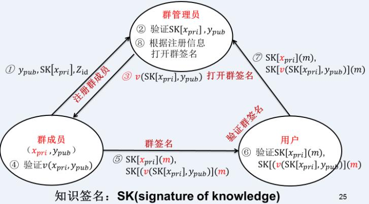

# 简介
在一个群签名方案中，一个群体中的`任意一个成员可以以匿名的方式代表整个群体对消息进行签名`。与其他数字签名一样，群签名是可以公开验证的，且可以只用单个群公钥来验证。

特点：
- 只有群中成员能够代表群体签名，群管理员不行（群特性）；
- 接收者可以用公钥验证群签名；
- 接收者不能知道由群体中哪个成员所签（无条件匿名保护），只有群管理员能知道；
- 群管理员在发生纠纷的情况下可以打开一个签名来确定出签名者的身份，而且任何人都不能阻止一个合法签名的打开（可追查性）。

Desmedt 和 Frankel 在 1991 年提出了基于门限的群签名实现方案。在签名时，一个具有 n 个成员的群体共用同一个公钥，签名时必须有 t 个成员参与才能产生一个合法的签名，t 称为门限或阈值。这样一个签名称为(n, t)不可抵赖群签名。

# 群签名一般流程：
1. 初始化：群管理者建立群资源，生成对应的`群公钥（Group Public Key）和群私钥（Group Private Key）`,群公钥对整个系统中的所有用户公开，比如群成员、验证者等。
2. 成员加入:在用户加入群的时候，群管理者颁发`群证书（Group Certificate）`给群成员。
3. 签名：群成员利用获得的`群证书签署文件`，生成群签名。
4. 验证：验证者利用`群公钥`可以验证所得群签名的正确性，但不能确定群中的正式签署者。
5. 打开：群管理者利用`群私钥可以对群用户生成的群签名进行追踪`，并暴露签署者身份

## 签名和群签名的比较：
- 匿名性。都是一种个体代表群体签名的体制，验证者能验证签名为群体中某个成员所签，但并不能知道为哪个成员，以达到签名者匿名的作用。
- 可追踪性。群签名中，`群管理员的存在保证了签名的可追踪性`。群管理员可以撤销签名，揭露真正的签名者。环签名本身无法揭示签名者,除非签名者本身想暴露或者在签名中添加额外的信息。
- 管理系统。群签名由群管理员管理，环签名不需要管理，签名者选择一个可能的签名者集合，获得其公钥，然后公布这个集合即可，所有成员平等。

# CS97方案
 Jan Camenisch 和 Markus Stadler 两个人在97在“Efficient Group Signature Schemes For Large Groups”这篇论文中提出的方案

## 初始化
群管理员GM获取下列值：

RSA公钥对 (n, e)

循环群G，g为生成元，n为G的阶

系统安全性参数a,λ(群成员私钥长度),ε

公开参数 (n, e, G, g, a, λ, ε)

群管理员保存RSA私钥对(n, d)

## 成员加入
1. 新成员Alice选择私钥x

2. Alice计算

    -   y = a^x (mod n)
    -  z = g^y
3. Alice发送y、z和自己对z的个人签名给群管理员GM，并使用知识签名证明自己知道满足y=a^x(mod n)的x

4. GM验证Alice的y和z的合法性，验证Alice知道x

5. GM保存(y, z)用于日后打开群签名

6. GM生成Alice的成员证书 v = (y + 1) ^ d (mod n)；并发送 成员证书 v 给 Alice

7. Alice验证 v 的正确性

## 群签名

## 验证群签名
验证群签名只需用到 双离散对数的知识签名(skloglog)，和离散对数的e次方根的知识签名 (skrootlog) 就可以了。

## 打开群签名
有上面的步骤三（3.成员进行群签名）可知: z' = g' ^ y ;所以群管理员只需遍历所有的群成员y，找到使等式成立的y就可以知道是哪个群成员做的群签名。

