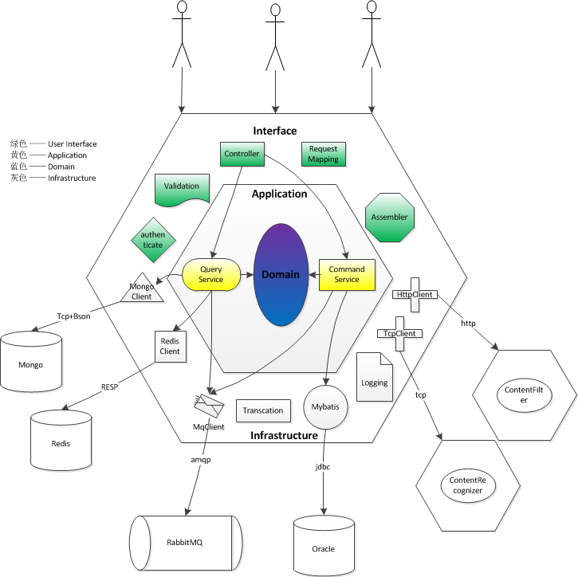
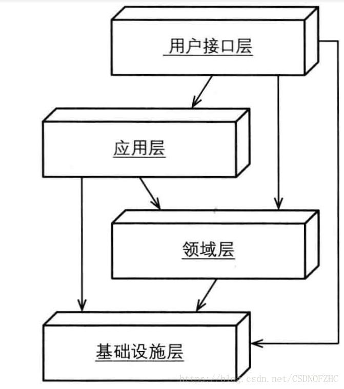

# Domain-driven Design

DDD为复杂软件的设计提供了指导思想，其将易发生变化的业务核心域放置在限定上下文中，在确保核心域一致性和内聚性的基础上

核心的指导思路归纳为：

- 关注点放在domain上，将业务领域限定在同一上下文中
- 降低上下文之间的依赖，通过‘开发主机服务’（REST服务是其中的一种）、‘消息模式’、‘事件驱动’等架构风格实现
- 遵循分层架构模式

# 概念
## 领域
一个领域本质上可以理解为就是一个问题域，只要是同一个领域，那问题域就相同。所以，只要我们确定了系统所属的领域，那这个系统的核心业务，即要解决的关键问题、问题的范围边界就基本确定了。通常我们说，要成为一个领域的专家，必须要在这个领域深入研究很多年才行。因为只有你研究了很多年，你才会遇到非常多的该领域的问题，同时你解决这个领域中的问题的经验也非常丰富。很多时候，领域专家比技术专家更加吃香，比如金融领域的专家。
## 模型
DDD是一种基于模型驱动开发的软件开发思想，强调领域模型是整个系统的核心，领域模型也是整个系统的核心价值所在。每一个领域，都有一个对应的领域模型，领域模型能够很好的帮我们解决复杂的业务问题。

从领域和代码实现的角度来理解，领域模型绑定了领域和代码实现，确保了最终的代码实现就一定是解决了领域中的核心问题的。因为：1）领域驱动领域模型设计；2）领域模型驱动代码实现。我们只要保证领域模型的设计是正确的，就能确定领域模型可以解决领域中的核心问题；同理，我们只要保证代码实现是严格按照领域模型的意图来落地的，那就能保证最后出来的代码能够解决领域的核心问题的。这个思路，和传统的分析、设计、编码这几个阶段被割裂（并且每个阶段的产物也不同）的软件开发方法学形成鲜明的对比。
## 驱动
1）领域驱动领域模型设计；2）领域模型驱动代码实现。这个就和我们传统的数据库驱动开发的思路形成对比了。DDD中，我们总是以领域为边界，分析领域中的核心问题（核心关注点），然后设计对应的领域模型，再通过领域模型驱动代码实现。而像数据库设计、持久化技术等这些都不是DDD的核心，而是外围的东西。

领域驱动设计（DDD）告诉我们的最大价值我觉得是：当我们要开发一个系统时，应该尽量先把领域模型想清楚，然后再开始动手编码，这样的系统后期才会很好维护。但是，很多项目（尤其是互联网项目，为了赶工）都是一开始模型没想清楚，一上来就开始建表写代码，代码写的非常冗余，完全是过程是的思考方式，最后导致系统非常难以维护。而且更糟糕的是，出来混总是要还的，前期的领域模型设计的不好，不够抽象，如果你的系统会长期需要维护和适应业务变化，那后面你一定会遇到各种问题维护上的困难，比如数据结构设计不合理，代码到处冗余，改BUG到处引入新的BUG，新人对这种代码上手困难，等。而那时如果你再想重构模型，那要付出的代价会比一开始重新开发还要大，因为你还要考虑兼容历史的数据，数据迁移，如何平滑发布等各种头疼的问题。所以，就导致我们最后天天加班。

## 概念总结
- 领域就是问题域，有边界，领域中有很多问题；
- 任何一个系统要解决的那个大问题都对应一个领域；
- 通过建立领域模型来解决领域中的核心问题，模型驱动的思想；
- 领域建模的目标针对我们在领域中所关心的问题，即只针对核心关注点，而不是整个领域中的所有问题；
领域模型在设计时应考虑一定的抽象性、通用性，以及复用价值；
- 通过领域模型驱动代码的实现，确保代码让领域模型落地，代码最终能解决问题；
- 领域模型是系统的核心，是领域内的业务的直接沉淀，具有非常大的业务价值；
- 技术架构设计或数据存储等是在领域模型的外围，帮助领域模型进行落地；

#
要掌握领域驱动设计，就不要被它给出的概念所迷惑，而要去思索这些概念背后蕴含的原理，多问一些为什么。同时，要学会运用设计原则去解决问题，而非所谓的“设计规范”。例如：

思考限界上下文边界的划分，实际上还是“高内聚、低耦合”原则的体现，只是我们需要考虑什么内容才是高内聚的，如何抽象才能做到低耦合？

是否需要提取单独的限界上下文？是为了考虑职责的重用，还是为了它能够独立进化以应对未来的变化？

在分层架构中，各层之间该如何协作？如果出现了依赖，该如何解耦？仍然需要从重用与变化的角度去思考设计决策。

为什么同样遵循领域驱动设计，不同的系统会设计出不同的架构？这是因为不同的场景对架构质量的要求并不一样，我们要学会对架构的关注点做优先级排列，从而得出不同的架构决策。

# 架构风格
## 六边形架构（端口和适配器）
所谓的六边形架构，其实是分层架构的扩展，原来的分层架构通常是上下分层的，比如常见的MVC模式，上层是对外的服务接口，下层是对接存储层或者是集成第三方服务，中层是业务逻辑层。我们跳出分层的概念，会发现上面层和下面层其实都是端口+适配器的实现，上面层开放http/tcp端口，采用rest/soap/mq协议等对外提供服务，同时提供对应协议的适配器；下层也是端口+适配器，只不过应用程序这时候变成了调用者，第三方服务或者存储层提供端口和服务，应用程序本身实现适配功能。

基于上述思考，将分层接口中的上层和下层统一起来就变成了六边形架构，基于端口和适配器的实现

## REST
REST——即Representational State Transfer的缩写，翻译过来是"表现层状态转化"。

RESTful风格的架构将‘资源’放在第一位，每个‘资源’都有一个URI与之对应，可以将‘资源’看着是ddd中的实体；RESTful采用具有自描述功能的消息实现无状态通信，提高系统的可用性；至于‘资源’的哪些属性可以公开出去，针对‘资源’的操作，RESTful使用HTTP协议的已有方法来实现：GET、PUT、POST和DELETE。

在DDD的实现中，我们可以将对外的服务设计为RESTful风格的服务，将实体/值对象/领域服务作为'资源'对外提供增删改查服务。但是并不建议直接将实体暴露在外，一来实体的某些隐私属性并不能对外暴露，二来某些资源获取场景并不是一个实体就能满足的，因此我们在实际实践过程中，在领域模型上增加了dto这样一个角色，dto可以组合多个实体/值对象的资源对外暴露。

## CQRS
CQRS——Cammand-Query Responsibility Segregation的缩写。翻译过来就是“命令与查询职责分离”。

简而言之，CQRS就是平常大家在讲的读写分离，通常读写分离的目的是为了提高查询性能，同时达到读/写的解耦。让DDD和CQRS结合，我们可以分别对读和写建模，查询模型通常是一种非规范化数据模型，它并不反映领域行为，只是用于数据显示；命令模型执行领域行为，且在领域行为执行完成后，想办法通知到查询模型。

那么命令模型如何通知到查询模型呢？ 如果查询模型和领域模型共享数据源，则可以省却这一步；如果没有共用数据源，则可以借助于‘消息模式’（Messaging Patterns）通知到查询模型，从而达到最终一致性（Eventual Consistency）。

Martin在blog中指出：CQRS适用于极少数复杂的业务领域，如果不是很适合反而会增加复杂度；另一个适用场景为获取高性能的服务

## 例子

1. 在遵循分层架构思想的基础上，引入了六边形架构风格，对内对外均通过适配器+端口的方式呈现：

- 面向用户侧，提供http端口，并使用SpringMVC框架的RequestMapping、Controller等组件实现对http 请求的解析，转化为Application层可识别的业务dto对象，这里的Controller+RequestMapping便起着适配器的作用；
- 面向第三方服务，通过httpclient和tcpclient的适配，可以对接多种协议的第三方服务端口；
- 面向存储层，通过mongoclient的适配，访问mongodb；通过mybatis的适配，访问oracle；通过redisclient的适配，访问redis；
- 面向消息中间件，通过mqclient的适配，方为rabbitMQ；
2. 实现了RESTful架构风格，通过RESTful风格的接口契约对外提供主机开放服务。借助SpringMVC实现。

3. 实现了CQRS架构风格：

- orcale作为命令模型存储存在，并配以Transaction事务管理。主要存储帖子、评论、话题、圈子、关注等实体信息；
- Mongodb作为查询模型存储存在，存储个人动态、社区动态等非结构化数据；
- redis同样作为查询模型存储存在，存储用户个人信息、热门评论、热门帖子、热门话题、用户点赞信息等；
- Application层分为QueryService和CommandService两大类应用服务，分别组合查询模型和命令模型；
- 使用rabbitMQ作为消息中间件，CommandService在完成命令模型的维护后，生产事件消息写入rabbitMQ，QueryService作为消费者从rabbitMQ读取事件消息，更新查询模型；
- 查询模型和命令模型极其对应的application service可以独立部署，独立扩展。
4. 遵循基本的分层架构风格。

- User Interface —— 用户接口层。对外提供各种协议形式的服务，并提供Validation参数校验，authenticate权限认证，业务实体组装器Assembler等。图中标绿组件。
- Application —— 应用服务层。组合多个业务实体、基础设施层的各种组件完成业务服务。图中标黄部分。
- Domain —— 业务领域层。DDD概念中的核心业务层，封装所有业务逻辑，包含entity、value object、domain service、domain event等。图中标蓝部分。
- Infrastructure —— 基础设施层。提供公共组件，如：Logging、Trascation、HttpClient等。图中标灰部分。

# 经典架构

这是一个松散分层架构（允许任意上方层与任意下方层发生耦合，或者说上方层可调用下方层，但下方层不允许调用上方层），其中每层的定义为：

- 用户接口层：用户接口层只用于处理用户显示和用户请求，它不应该包含领域或业务逻辑。如果用户界面使用了领域模型中的对象，那么此时的领域对象仅限于数据的渲染展现（我猜测在使用中将领域对象转化为DTO是个不错的选择）。
- 应用层：应用服务位于应用层中。应用服务（Application services）和领域服务（Domain Services）是不同的，因此领域逻辑也不应该出现在应用服务中（如何划分领域逻辑与应用逻辑？）。应用服务可以用于控制持久化事务和安全认证。应用服务本身并不处理业务逻辑，但它确却是领域模型的直接客户。
应用服务是很轻量的，它主要用于协调对领域对象的操作，比如聚合（此处稍微有些笼统）。因此，应用服务的通常用途是：接收来自用户界面的输入参数，再通过资源库（在基础设施层中，数据来源自数据库或者MQ等）获取到聚合实例，然后执行相应的命令操作

## 建模工具
DDD原著中提出了很多实用的建模工具：聚合、实体、值对象、工厂、仓储、领域服务、领域事件。我们可以使用这些工具，来设计每一个子域的领域模型。最终通过领域模型图将设计沉淀下来

## 后续设计
领域模型设计只是整个软件设计中的很小一部分。除了领域模型设计之外，要落地一个系统，我们还有非常多的其他设计要做，比如：

- 容量规划
- 架构设计
- 数据库设计
- 缓存设计
- 框架选型
- 发布方案
- 数据迁移、同步方案
- 分库分表方案
- 回滚方案
- 高并发解决方案
- 一致性选型
- 性能压测方案
- 监控报警方案